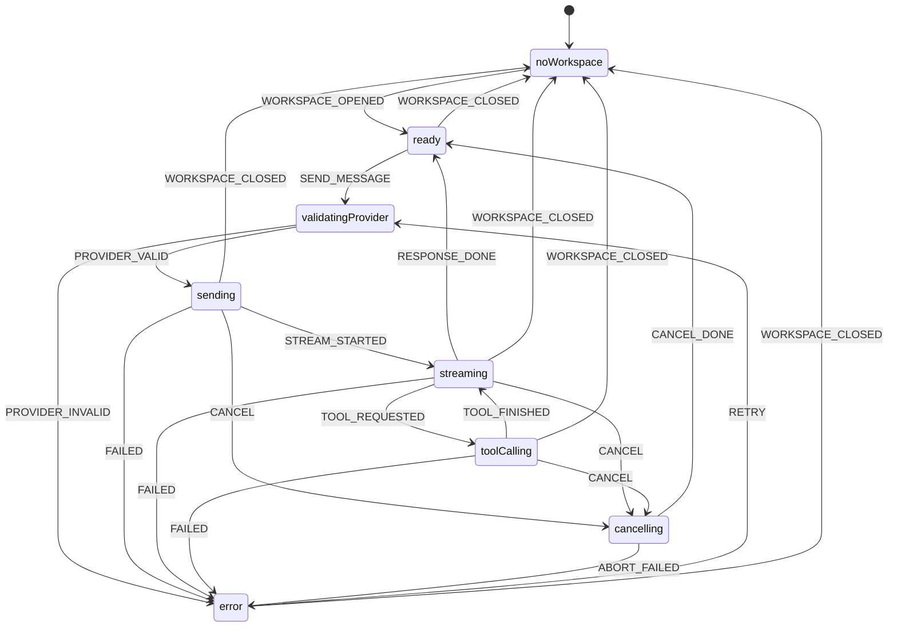

---
文档编号：   AG-M-P-04
文档状态：   A
负责模块：   AG
文档职责：   chatMachine 状态机设计——Agent 对话会话全链路状态驱动
上游约束：   CORE-C-P-01、AG-M-D-01（REQ-AG-008/009）、AG-M-T-01、AG-M-P-01、AG-M-P-02
直接承接：   Phase 10 Issue Trace、agentMachine 实现迁移为 chatMachine
使用边界：   定义 chatMachine 状态、事件、Context 和门禁约束，不写 XState 运行时代码
变更要求：   新增状态、事件或 Context 字段必须同步 AG-M-T-01 和测试矩阵
---

# ChatMachine 状态机设计

## 1. 设计原则

1. Agent 对话链路全部由 chatMachine 驱动，不存在游离于状态机之外的中间状态。
2. chatMachine 管理会话生命周期（Workspace 打开→关闭）、消息列表、Provider 状态、流式响应和工具调用。
3. 所有合法状态转移必须通过显式事件触发，不允许直接修改 Context。
4. 工具调用执行结果（ToolResult）由状态机通过 TOOL_FINISHED 事件消费，不绕过状态机注入。

## 2. 状态定义



## 3. 状态语义

| 状态 | 语义 | 允许操作 |
|------|------|----------|
| `noWorkspace` | 无 Workspace，聊天功能不可用 | 等待 WORKSPACE_OPENED |
| `ready` | Workspace 已打开，可接收用户输入 | SEND_MESSAGE |
| `validatingProvider` | 校验 Provider 配置（类型、模型、key 有效性）| 等待 PROVIDER_VALID / PROVIDER_INVALID |
| `sending` | Provider 请求已提交，等待 SSE 流开始信号 | CANCEL / 等待 STREAM_STARTED |
| `streaming` | 接收流式响应 token，渲染中 | CANCEL / 等待 TOOL_REQUESTED / RESPONSE_DONE |
| `toolCalling` | 正在执行一次或多次工具调用 | CANCEL / 等待 TOOL_FINISHED |
| `cancelling` | 用户主动取消，等待 SSE 流 / 工具执行中止 | 等待 CANCEL_DONE |
| `error` | 出错终态（Provider 错误 / 网络错误 / 超时）| RETRY |

## 4. 事件定义

| 事件 | 触发来源 | 语义 |
|------|----------|------|
| `WORKSPACE_OPENED` | workspaceMachine | Workspace 进入 active 状态 |
| `WORKSPACE_CLOSED` | workspaceMachine | Workspace 进入 idle/closing 状态 |
| `SEND_MESSAGE` | User（UI 输入框）| 用户提交消息，携带 userContent + inputReferences |
| `PROVIDER_VALID` | SYS（Provider 校验结果）| Provider 配置有效，可发起请求 |
| `PROVIDER_INVALID` | SYS | Provider 配置缺失或无效 |
| `STREAM_STARTED` | SYS（SSE 开始信号）| SSE 连接建立，开始接收 token |
| `TOKEN_RECEIVED` | SYS（SSE token 事件）| 接收到单个 token，更新流式展示 |
| `TOOL_REQUESTED` | SYS（SSE tool_call 事件）| 模型请求工具调用 |
| `TOOL_FINISHED` | SYS（工具执行结束）| 工具执行完成，携带 ToolResult |
| `RESPONSE_DONE` | SYS（SSE done 事件）| 模型完成响应（finishReason: stop / max_tokens）|
| `CANCEL` | User（取消按钮）| 用户主动取消当前请求 |
| `CANCEL_DONE` | SYS | SSE 流 / 工具执行已中止确认 |
| `FAILED` | SYS | Provider 错误 / 网络错误 / 工具超时（10s）|
| `ABORT_FAILED` | SYS | cancelling 状态下 Rust SSE abort 返回 FAILED 而非 CANCELLED；chatMachine 转 error，error.message 标注"取消过程中发生错误" |
| `RETRY` | User | 用户从 error 状态重试 |
| `ACTIVE_FILE_CHANGED` | editorMachine | 用户切换活跃文件；chatMachine 向 messages 追加合成系统消息标记上下文切换（见 §6.6）|

## 5. Context 定义

```typescript
interface ChatMachineContext {
  // 会话元数据
  workspaceRoot: string | null;

  // 消息列表（含 streaming 中的消息）
  messages: AgentMessage[];

  // 当前流式消息的累积内容（streaming 状态下使用）
  streamingContent: string;

  // 工具调用执行队列（toolCalling 状态下使用）
  // 单轮 SSE 中模型可能返回多个 tool_use block；队列按返回顺序依次执行（顺序化，非并行）
  pendingToolExecutions: ToolExecution[];   // 待执行队列
  activeToolExecution: ToolExecution | null; // 当前正在执行的工具（队列头）

  // 当前 InputReference 列表（发送成功后清空）
  inputReferences: InputReference[];

  // 错误信息（error 状态下使用）
  errorCode: string | null;
  errorMessage: string | null;
}
```

Context 变更规则：

1. `messages` 只通过状态机 assign 操作追加，不得外部直接 push。
2. `streamingContent` 在 streaming 状态每次 TOKEN_RECEIVED 时累积，RESPONSE_DONE 或 CANCEL 时合并到 messages 并清空。
3. `inputReferences` 在 SEND_MESSAGE 事件触发时快照到 payload，RESPONSE_DONE 后清空；FAILED/CANCEL 后保留。
4. `pendingToolExecutions` 在 streaming 收到全部 tool_use block 后整体写入，进入 toolCalling 时从队列头取出 `activeToolExecution`；TOOL_FINISHED 后结算当前项，若队列非空继续取下一个，队列空时回 streaming 等待 RESPONSE_DONE；CANCEL 时清空队列并标记 activeToolExecution 为 cancelled。
5. RETRY 从 error 状态重发时：context.messages 截断至最后一条**完整** assistant message（partial streaming 内容丢弃）；若无完整 assistant message，messages 保持 SEND_MESSAGE 之前的状态重发。
6. 文件切换合成消息：收到 ACTIVE_FILE_CHANGED 时，向 messages 追加 `role: "system"` 的合成消息 `"[Context: Active file switched from {oldPath} to {newPath}]"`；此消息参与 N 条裁剪计算，不单独维护。

## 6. 门禁约束

### 6.1 SEND_MESSAGE 门禁

只有在以下条件全部满足时才允许触发 SEND_MESSAGE：

1. chatMachine 处于 `ready` 状态（不在 sending / streaming / toolCalling / cancelling）。
2. Provider 配置完整（type、model、apiKeyConfigured 均有效）。
3. userContent 非空。

违反任一条件时 UI 发送按钮不可用，不抛出异常。

### 6.2 CANCEL 门禁

CANCEL 只在 `sending`、`streaming`、`toolCalling` 三个状态有效；`noWorkspace`、`ready`、`cancelling`、`error` 状态下忽略 CANCEL 事件。

### 6.3 WORKSPACE_CLOSED 处理

WORKSPACE_CLOSED 在任意状态下均有效：

- 若当前处于 `sending` / `streaming` / `toolCalling`：直接转 `noWorkspace`，不经 `cancelling` 状态（SSE 流和工具执行的中止由 noWorkspace 进入后的清理逻辑处理）。
- 若当前处于 `ready` / `error`：直接转 `noWorkspace`。
- `noWorkspace` 时忽略。

转入 `noWorkspace` 时的处理顺序（对齐 REQ-AG-010、AG-CAND-PERSIST-001）：

1. **先持久化**：将当前 `messages`（完整的已结算消息；streamingContent 中的 partial 内容丢弃）持久化到当前 Workspace 的 `workspace.db` chat_messages 表；持久化失败时记录错误日志，不阻断后续清理。
2. **再清空内存**：清空 `messages`、`streamingContent`、`inputReferences`、`activeToolExecution`、`pendingToolExecutions`。

WORKSPACE_OPENED 时从对应 Workspace 的 `workspace.db` 读取历史 messages 并写入 Context，恢复上次对话状态。历史消息中关联的 PendingDiff 只展示终态卡片，不渲染可执行操作按钮。

### 6.4 工具超时

工具调用（toolCalling 状态）在 10 秒内未收到 TOOL_FINISHED 时，自动发出 FAILED 事件，工具进入 error 终态，chatMachine 转 `error`。

### 6.5 取消语义

cancelling → ready 后：

- 已生成的部分流内容（streamingContent 快照）在 UI 中以 `streamStatus: "cancelled"` 保留展示。
- 不追加完整轮次消息到历史（不添加 assistant 消息的完整版本）。
- inputReferences 保留（供用户重发）。

### 6.6 ACTIVE_FILE_CHANGED 处理

ACTIVE_FILE_CHANGED 在 `ready`、`sending`、`streaming`、`toolCalling`、`error` 状态下均有效（`noWorkspace` 时忽略）：

1. 向 `messages` 追加合成系统消息：`[Context: Active file switched from {oldPath} to {newPath}]`
2. 此消息 `role` 为 `"system"`，标记会话焦点切换，帮助模型在后续轮次对切换前的文件上下文自然降权
3. **不触发任何状态转移**，不清空历史，不压缩内容
4. chatMachine 不维护 activeFilePath；L0 层的 workspaceContext 在每次 SEND_MESSAGE 时从 editorMachine 实时读取当前值

## 7. 与现有 agentMachine 的关系

当前代码中的 `agentMachine` 覆盖了部分状态（idle / validatingProvider / sending / streaming / toolCalling / error），Phase 10 实现时：

1. 将 `agentMachine` 重命名/迁移为 `chatMachine`。
2. 扩展新增 `noWorkspace` 和 `cancelling` 状态。
3. `idle` 状态拆分为 `noWorkspace`（无 Workspace）和 `ready`（有 Workspace 可发送）。
4. 新增 WORKSPACE_OPENED / WORKSPACE_CLOSED / CANCEL / CANCEL_DONE / RETRY 事件。
5. Context 从无 `messages` 管理扩展为完整 ChatMachineContext。

## 8. 与其他文档的关系

| 文档 | 关系 |
|------|------|
| AG-M-D-01 REQ-AG-008/009 | 需求来源（取消行为 + 状态机强制要求）|
| AG-M-T-01 | agentMachine 状态机定义（本文扩展并取代）|
| AG-M-P-01 工具调用协议 | TOOL_REQUESTED / TOOL_FINISHED 事件的工具执行边界 |
| AG-M-P-02 PromptRuntime | SEND_MESSAGE 时 payload 组装（L0-L3 层）|
| AG-M-P-03 InputReference | inputReferences Context 字段的生命周期 |
| WS 模块 workspaceMachine | WORKSPACE_OPENED / WORKSPACE_CLOSED 事件来源 |

## 变更记录

| 日期 | 版本 | 变更内容 |
|------|------|---------|
| 2026-05-23 | v1.0 | 初始版本，定义 chatMachine 完整状态机（对齐 binder-core 状态机驱动原则，补全 REQ-AG-008/009）|
| 2026-05-23 | v1.1 | §2 状态图：补充 sending/streaming/toolCalling → noWorkspace 直接边（WORKSPACE_CLOSED）；删除错误的 error → ready WORKSPACE_CLOSED 边；§6.3 说明修正为"直接 → noWorkspace，不经 cancelling" |
| 2026-05-24 | v1.2 | §2 状态图 cancelling→error 事件改为 ABORT_FAILED（区分正常 CANCEL_DONE）；§4 新增 ABORT_FAILED 事件描述；§5 Context 新增 pendingToolExecutions 队列（D-03 顺序化并行工具调用），补充 RETRY partial message 截断语义（规则 5）；§6.3 WORKSPACE_CLOSED 处理改为先持久化后清空内存（D-04，对齐 REQ-AG-010），补充 WORKSPACE_OPENED 读取历史逻辑 |
| 2026-05-24 | v1.3 | §4 新增 ACTIVE_FILE_CHANGED 事件（editorMachine → chatMachine）；§5 Context 规则 6 补充文件切换合成系统消息语义；§6.6 新增 ACTIVE_FILE_CHANGED 处理协议（追加合成消息、不触发状态转移、chatMachine 不维护 activeFilePath）|
