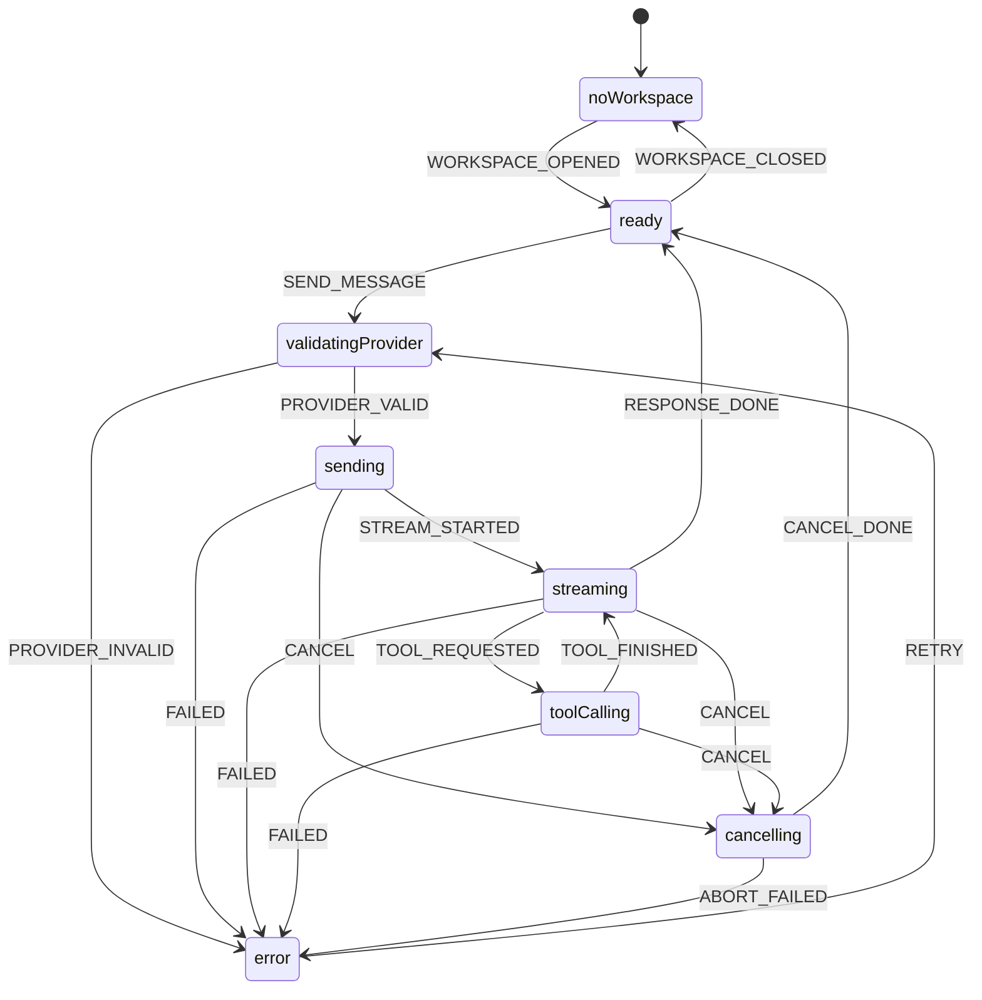

---
文档编号：   AG-M-T-01
文档状态：   A
负责模块：   AG
文档职责：   Agent 技术设计、能力契约和规则来源
上游约束：   CORE-C-P-01、AG-M-D-01、SYS-C-T-01、SYS-C-T-02
直接承接：   chatMachine、agentService、Provider Adapter、PromptRuntime、工具执行链路
使用边界：   定义 Agent 技术方案和规则来源，不写运行时代码，不表达实现完成度
变更要求：   修改 Provider 协议、工具矩阵、状态机或 Prompt Runtime 策略必须同步 SYS-C-T-01 和测试
---

# Agent 技术设计

## 1. 能力索引

本节只列出 Agent 能力与规则入口，不判断代码实现状态。

| 能力 | 检索入口 | 承接规则 |
|------|----------|----------|
| Provider 配置结构（type、model、apiKeyConfigured） | AG-M-P-04、ProviderConfig UI | BR-AG-STATE-001 |
| Provider API key 持久化 | §3.2 ProviderCredential、ProviderConfig UI、后端 Provider 凭据存储 | BR-AG-SEC-001、BR-AG-PERSIST-002 |
| Provider 校验门控 | AG-M-P-04、ChatInput 状态驱动 | BR-AG-STATE-001、BR-AG-UI-001 |
| Provider 流式响应 | §4 Provider SSE 协议、Provider Adapter | BR-AG-STATE-002 |
| read_file / list_files / search_files 只读工具 | AG-M-P-01 工具矩阵 | BR-AG-OBS-001、BR-AG-DATA-001 |
| ToolExecution / ToolResult | AG-M-P-01 工具结果回流 | BR-AG-OBS-001、BR-AG-DATA-002 |
| InputReference 结构化内容载体 | AG-M-P-03、AG-M-P-02 L1 注入 | BR-AG-DATA-001 |
| PromptRuntime / allowedTools | AG-M-P-02、AG-M-P-01 | BR-AG-SEC-001、BR-AG-STATE-003 |
| AgentMessage 结构 | AG-M-P-04、AG-M-P-02 历史裁剪 | BR-AG-STATE-001、BR-AG-PERSIST-001 |

## 2. 状态机设计

### 2.1 chatMachine

Agent 对话全链路由 chatMachine 驱动。完整状态机设计见 **AG-M-P-04**，本节摘要核心状态和迁移约束。



状态语义：

| 状态 | 含义 | 约束 |
|------|------|------|
| `noWorkspace` | 无 Workspace，聊天不可用 | 等待 WORKSPACE_OPENED |
| `ready` | 可接收用户输入 | SEND_MESSAGE |
| `validatingProvider` | 校验 Provider 配置 | Provider 无效时转 error |
| `sending` | 已提交 Provider 请求 | 等待 STREAM_STARTED；可 CANCEL |
| `streaming` | 接收流式 token | 可被 TOOL_REQUESTED 打断；可 CANCEL |
| `toolCalling` | 执行工具调用（10s 超时）| 工具完成后返回 streaming；可 CANCEL |
| `cancelling` | 用户主动取消，等待中止确认 | 等待 CANCEL_DONE |
| `error` | 出错等待恢复 | RETRY 重新进入 validatingProvider |

### 2.2 状态机迁移约束

如存在旧 `agentMachine` 路径，必须按以下要求迁移为 `chatMachine`：

1. `idle` 状态拆分为 `noWorkspace`（无 Workspace）和 `ready`（有 Workspace）。
2. 新增 `cancelling` 状态，CANCEL 在 sending/streaming/toolCalling 任一阶段均有效。
3. 新增 WORKSPACE_OPENED / WORKSPACE_CLOSED 事件，与 workspaceMachine 联动。
4. error 状态携带错误类型：`provider_error` / `network_error` / `tool_error` / `timeout`。
5. streaming 不得在 toolCalling 完成前宣告 RESPONSE_DONE。
6. Context 扩展为完整 ChatMachineContext（见 AG-M-P-04 §5）。

## 3. 数据结构

### 3.1 ProviderConfig

```ts
interface ProviderConfig {
  provider: "openai" | "anthropic" | "deepseek";
  model: string;
  apiKeyConfigured: boolean;  // key 只在后端持有，前端不可见
}
```

约束：API key 不得出现在前端结构、日志或 Provider payload 的调试输出中。

### 3.2 ProviderCredential

```ts
interface ProviderCredential {
  provider: "openai" | "anthropic" | "deepseek";
  apiKey: string;       // 仅后端持有
  updatedAt: number;
}
```

持久化约束：
- ProviderCredential 是应用级配置，不绑定 Workspace；Workspace 切换、关闭、重新打开不得清空。
- 后端负责保存、读取和覆盖 ProviderCredential；前端只能接收 `ProviderConfig.apiKeyConfigured`。
- 明文 API key 不得写入 React state、localStorage、workspace.db、聊天历史、调试日志或 Provider payload 调试输出。
- 同一 Provider 重新保存 key 时覆盖旧值；读取配置状态失败时必须返回可识别错误或 `apiKeyConfigured=false`，不得假定已配置。

### 3.3 AgentMessage

```ts
interface AgentMessage {
  id: string;
  role: "user" | "assistant" | "system";
  content: string;
  streamStatus?: "streaming" | "complete" | "failed";
  toolCalls?: ToolCall[];       // 模型返回的 tool_call 列表
  toolResults?: ToolResult[];   // 本轮工具结果，同轮回流
}
```

### 3.4 ToolExecution

```ts
interface ToolExecution {
  id: string;
  toolName: ToolName;
  inputBoundary: string;        // 工具输入边界描述
  status: "pending" | "running" | "succeeded" | "failed";
  resultSummary?: string;
  errorMessage?: string;
  workspaceRoot: string;        // 显式记录执行边界
  callId?: string;              // 对应模型 tool_call 的 call_id
}
```

### 3.5 ToolName

当前：`"read_file" | "list_files" | "search_files" | "edit_current_editor_document"`

工具矩阵扩展项：`"create_file" | "create_folder" | "rename_file" | "move_file" | "delete_file" | "update_file" | "web_search"`

所有写操作工具（create/rename/move/delete/edit/update）必须先在 DE-M-T-01 确认 Diff Review 路由协议后，才能进入工具矩阵。内容编辑工具（`edit_current_editor_document`、`update_file`）使用 `originalText + newText` 字符精确替换接口，不得使用全量内容替换。

### 3.6 InputReference

```ts
type InputReference =
  | { id: string; kind: "text"; content: string; displayName: string; createdAt: number }
  | { id: string; kind: "url"; url: string; displayName: string; createdAt: number };
```

约束：
- `kind` 为判别字段（discriminant），不使用 `type` 或 `mode`
- InputReference 仅由 ChatInput 粘贴入口创建，支持 text 和 url 两类
- InputReference 是结构化内容载体，不声明写权威；是否触发 Diff Review 由 Agent 根据上下文判断

### 3.7 PromptRuntime

```ts
interface PromptRuntime {
  workspaceRoot: string;
  activeFilePath?: string;
  activeFileMode?: "editable" | "readonly";
  activeFileDirty?: boolean;
  pendingDiffCount?: number;
  activeFileLogicalStateSnapshot?: string;
  allowedTools: ToolName[];           // 过滤后传给 Provider 的工具列表
  inputReferences: InputReference[];  // 结构化内容载体注入
  // 禁止字段：apiKey、userId、内部系统路径
}
```

`activeFileLogicalStateSnapshot` 必须由 ED Runtime 从 ActiveFile LogicalState 读取，包含未保存用户编辑和已 preapplied 的 AI 修改。它是 `edit_current_editor_document` 生成 `originalText` 的上下文源；`read_file`、`search_files`、FTS5 索引和 DiskState 只能提供磁盘/工作区视角，不得替代该快照。

## 4. Provider SSE 协议

### 4.1 请求协议

后端 Tauri command `send_chat_message` 接收：

```
workspaceRoot: string
provider: ProviderConfig (不含 API key 明文)
messages: AgentMessage[]
tools: ToolDefinition[]  // 来自 allowedTools 过滤结果
```

API key 由后端 Rust 从 ProviderCredential 持久化存储读取，不经前端传递。

### 4.2 流式事件协议（`chat-stream-event`）

```
type: "token" | "tool_call" | "tool_result" | "done" | "error"
payload:
  token:       { content: string }
  tool_call:   { callId: string; toolName: ToolName; arguments: object }
  tool_result: { callId: string; result: string; isError: boolean }
  done:        { finishReason: "stop" | "tool_calls" | "max_tokens" }
  error:       { code: string; message: string }
```

### 4.3 工具结果回流约束

工具结果必须在同一对话轮次内以 `tool_result` 事件返回，不得以 user message 形式注入对话历史。

## 5. 工具矩阵

### 5.1 只读工具

| 工具 | 边界约束 | 结果类型 |
|------|----------|----------|
| read_file | Workspace 边界内路径 | 文件文本内容摘要 |
| list_files | Workspace 边界内目录 | FileNode 列表 |
| search_files | Workspace 边界内搜索 | SearchResult 列表 |

### 5.2 写操作工具

| 工具 | Diff Review 路由 | 前置门禁 |
|------|-----------------|----------|
| edit_current_editor_document | 必须生成 PendingDiff | 已打开文件；上下文源为 ED LogicalStateSnapshot |
| update_file | 必须生成 PendingDiff | 未打开文件链路 |
| create_file | 直接创建（content 参数必填，写入初始内容，不经 Diff Review）| PathConflict 检查 |
| create_folder | 直接创建 | PathConflict 检查 |
| rename_file | 结构操作 + PathConflict | 无 pending diff 影响 |
| move_file | 结构操作 + PathConflict | 无 pending diff 影响 |
| delete_file | 需明确删除意图 | 无 pending diff 影响 |

写操作工具进入运行时前，必须先在 WS-M-T 和 DE-M-T-01 中注册对应规则，不得在 AG 层绕过 Diff Review 直接写文件。

## 6. Prompt Runtime

### 6.1 组装约束

1. Provider-visible prompt 必须由后端 Rust 组装，不在前端明文拼接发送。
2. `allowedTools` 由 PromptRuntime 场景动态决定（依据当前 Workspace 状态和操作上下文），不由模型自行扩展，不是按 Provider 类型全局静态配置。
3. InputReference 内容只注入 system prompt L1 层（XML 块格式，见 AG-M-P-03），不替代 user message。
4. 历史裁剪时不得把工具结果注入成 user message；工具结果以 provider-native `role=tool` + `tool_call_id` 结构保留在同一轮次。
5. 禁止字段（API key、内部绝对路径、用户身份）必须在后端组装时被过滤。

### 6.2 Forbidden Provider Fields

模型不得接触以下字段：

- API key 或任何 Bearer token 原文
- 应用内部文件系统绝对路径（仅传 Workspace 相对路径）
- 用户身份标识符（若未来引入）

### 6.3 工具超时约束

单次工具调用（toolCalling 状态）超时为 **10 秒**。超时后：

1. 工具进入 `error` 终态，callId 关联的 ToolExecution 状态更新为 `failed`（reason: timeout）。
2. chatMachine 发出 FAILED 事件，转入 `error` 状态。
3. SSE 流不主动中断（等待 Provider 端自行结束或超时），chatMachine 已在 error 状态。

### 6.4 tool_result 注入协议

工具结果必须以 provider-native 结构回流同一对话轮次：

- **OpenAI**：`{ role: "tool", tool_call_id: callId, content: result }`
- **Anthropic**：content block `{ type: "tool_result", tool_use_id: callId, content: result }`

Provider Adapter 负责将统一内部 ToolResult 格式转换为各 Provider 原生格式，不得将工具结果伪装为新的 user message 注入历史。

## 7. 历史候选规则索引

以下条目仅保留历史检索关系，不能作为代码 `@GOV` 映射目标，也不表达实现状态。

| 历史候选规则 ID | 候选链路 | 来源需求 | 现行规则入口 |
|-------------|----------|----------|----------|
| ~~AG-CAND-STATE-002~~ | AG-SEND-MESSAGE | REQ-AG-002 | BR-AG-STATE-002 |
| ~~AG-CAND-DATA-002~~ | AG-TOOL-CALL | REQ-AG-003 | BR-AG-DATA-002 |
| ~~AG-CAND-DATA-003~~ | AG-SEND-MESSAGE | REQ-AG-007 | BR-AG-SEC-001 |
| ~~AG-CAND-STATE-003~~ | AG-SEND-MESSAGE | REQ-AG-007 | BR-AG-STATE-003 |
| ~~AG-CAND-DATA-004~~ | AG-TOOL-CALL | REQ-AG-006 | BR-AG-DATA-001 |

## 8. 已注册正式规则引用

| 规则 ID | 主链路 | 规则意图 |
|---------|--------|----------|
| BR-AG-STATE-001 | AG-SEND-MESSAGE | Provider 缺失或无效时不得发起 AI 请求。 |
| BR-AG-OBS-001 | AG-TOOL-CALL | 工具执行必须记录名称、输入边界、状态和错误。 |
| BR-AG-DATA-001 | AG-SEND-MESSAGE、AG-TOOL-CALL | InputReference 是结构化内容载体；引用内容通过 PromptRuntime 注入，不直接触发文件写入或 diff 接受。 |
| BR-AG-STATE-002 | AG-SEND-MESSAGE | 真实 Provider SSE 流错误必须终止并驱动 chatMachine 进入失败状态。 |
| BR-AG-DATA-002 | AG-TOOL-CALL | ToolResult 必须在同一轮次按 callId 回流，不得伪装为 user message。 |
| BR-AG-SEC-001 | AG-SEND-MESSAGE | Provider API key 只允许后端安全存储持有，前端和 Provider payload 日志不得出现明文。 |
| BR-AG-PERSIST-002 | AG-SEND-MESSAGE | ProviderCredential 必须应用级持久化，跨应用重启和 Workspace 切换保持有效，读取状态只返回 apiKeyConfigured。 |
| BR-AG-STATE-003 | AG-SEND-MESSAGE、AG-TOOL-CALL | PromptRuntime 必须动态计算 allowedTools；后端必须拒绝 allowedTools 之外的 ToolCall。 |
| BR-AG-PERSIST-001 | AG-SEND-MESSAGE | AgentMessage 和终态差异卡随 Workspace 关闭落盘、打开恢复。 |
| BR-AG-DATA-003 | AG-TOOL-CALL、DE-CREATE-DIFF | 内容编辑工具必须使用 originalText + newText 字符精确替换接口。 |
| BR-AG-DATA-004 | AG-SEND-MESSAGE、AG-TOOL-CALL、DE-CREATE-DIFF | ActiveFile 内容编辑必须以 ED LogicalStateSnapshot 为上下文源；read_file/DiskState 不得替代当前编辑器逻辑态。 |
| BR-AG-TOOL-001 | AG-TOOL-CALL、WS-FILE-MANAGE | 结构操作工具必须经 WS 工具链和 PathConflict 守卫。 |

## 9. 能力验收索引

Provider 流式与状态机：

1. 真实 Provider SSE 流可建立、接收 token、处理 tool_call 和检测错误。
2. 流中断或 Provider 返回错误时 UI 显示明确失败状态。
3. API key 不出现在前端代码、日志或 Store 中；前端只保存非敏感配置状态，明文 key 由后端安全存储或应用配置目录持有。
4. chatMachine 状态转移覆盖 noWorkspace / ready / validatingProvider / sending / streaming / toolCalling / cancelling / error 全路径（迁移自 agentMachine）。
5. 工具调用 10s 超时后 chatMachine 进入 error 状态，UI 展示明确超时提示。
6. 取消操作（cancelling 路径）可在 sending / streaming / toolCalling 任一阶段触发，完成后 chatMachine 回 ready。

工具调用：

1. 写操作工具结果经由 Diff Review 路由，不直接写文件。
2. 工具结果以 provider-native `role=tool` + `tool_call_id` 结构在同一轮次内回流，不作为 user message 注入。
3. 结构冲突（PathConflict）在工具层返回，不静默覆盖。

Prompt Runtime：

1. allowedTools 场景动态过滤生效，模型不能调用未授权工具。
2. Prompt 组装在后端完成，前端只传最小必要参数。
3. InputReference 注入不影响文件状态。

## 变更记录

| 日期 | 版本 | 变更内容 |
|------|------|---------|
| 2026-05-25 | v2.0 | 补齐 API key 持久化设计：新增 ProviderCredential 数据结构和后端应用级持久化约束，接入 BR-AG-PERSIST-002 |
| 2026-05-25 | v2.1 | 补齐 ActiveFile 编辑上下文设计：PromptRuntime 新增 activeFileLogicalStateSnapshot，edit_current_editor_document 明确以 ED LogicalStateSnapshot 为上下文源并接入 BR-AG-DATA-004 |
| 2026-05-25 | v1.9 | 治理修复：移除正文中的阶段完成判断，改为能力契约、检索入口和历史候选规则索引；明确本文不表达实现完成度 |
| 2026-05-23 | v1.0 | 初始版本，定义 Agent Phase 10-12 技术方案、状态机、数据结构、协议和候选规则 |
| 2026-05-23 | v1.1 | §2 agentMachine 升级为 chatMachine 设计（完整状态机见 AG-M-P-04）；§6 补充 allowedTools 场景动态决策、工具超时 10s 约束、tool_result provider-native 协议；§9 Phase 10 验收标准补充 chatMachine 迁移要求和取消路径验证 |
| 2026-05-23 | v1.2 | §3.5 InputReference 重构为判别联合类型（kind: text|url），移除旧 mode:"readonly" 字段；§5.2 create_file 说明改为 content 必填不经 Diff Review |
| 2026-05-24 | v1.3 | §2.1 状态图 cancelling→error 事件名从 FAILED 修正为 ABORT_FAILED（与 AG-M-P-04 §2/§4 对齐） |
| 2026-05-24 | v1.4 | §3.4 ToolName 新增 Phase 13-B 候选 edit_document_block（依赖 BlockId 稳定性策略和 L0 文档结构注入机制）|
| 2026-05-24 | v1.5 | 精确编辑架构对齐（D-02）：§3.4 ToolName 移除 edit_document_block 候选（定位能力折叠进 edit_current_editor_document anchor 字段，不作为独立工具存在）；内容编辑工具说明改为 originalText+newText 字符精确替换接口 |
| 2026-05-24 | v1.6 | 审计修复：InputReference 统一为结构化内容载体；§7 标记已升级候选规则；§8 补齐正式规则引用，消除 BR-AG-DATA-001 只读语义残留 |
| 2026-05-24 | v1.8 | 审计修复：AG-CAND-STATE-003 升级为 BR-AG-STATE-003；§8 补充 allowedTools 动态过滤和未授权 ToolCall 拒绝正式规则 |
