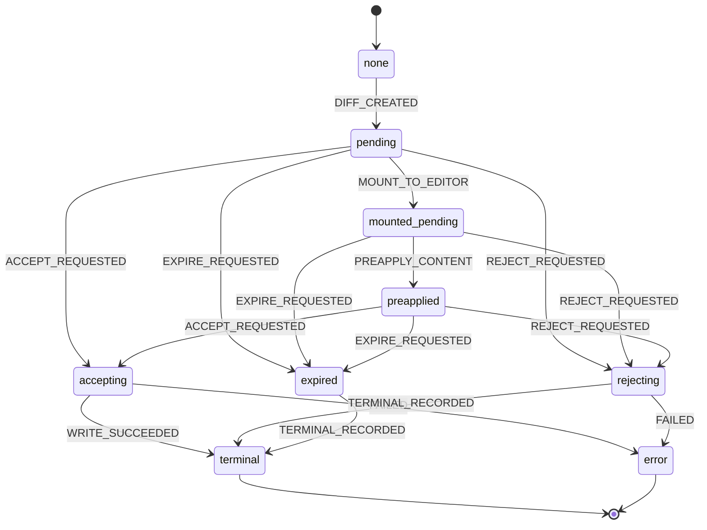

---
文档编号：   DE-M-T-01
文档状态：   A
负责模块：   DE
文档职责：   Diff Review 技术设计与 Phase 13 方案
上游约束：   CORE-C-P-01、DE-M-D-01、SYS-C-T-01、SYS-C-T-02
直接承接：   Phase 13 Issue Trace、diffMachine、diffService 实现
使用边界：   定义 Diff Review 技术方案和规则来源，不写运行时代码
变更要求：   修改状态机、数据结构、持久化协议或 anchor 策略必须同步 SYS-C-T-01 和测试
---

# Diff Review 技术设计

## 1. 当前实现范围（Phase 5 已有）

已实现的 Diff Review MVP 范围：

| 功能 | 实现状态 | 承接规则 |
|------|----------|----------|
| PendingDiff 数据结构（id、filePath、originalText、proposedText、status、summary） | 已实现 | BR-DE-STATE-001 |
| createPendingDiffFromCurrentEditor | 已实现 | BR-DE-STATE-001 |
| canExecutePendingDiff（status === "pending" 检查） | 已实现 | BR-DE-STATE-001 |
| acceptPendingDiff（校验 originalText + 写入） | 已实现 | BR-DE-PERSIST-001 |
| rejectPendingDiff（终态记录） | 已实现 | BR-DE-STATE-002 |
| shouldExpirePendingDiff（路径或内容变化检测） | 已实现 | BR-DE-STATE-003 |
| TerminalDiffCard（diffId、status、message） | 已实现 | BR-DE-STATE-002, BR-DE-STATE-003 |
| diffMachine 状态机（none/pending/accepting/rejecting/expired/terminal/error） | 已实现 | BR-SYS-GOV-001 |

当前 MVP 的限制：

1. PendingDiff 不携带来源信息（无 sourceToolId、无 baseRevision）。
2. 只支持当前已打开文件（无 update_file 未打开文件链路）。
3. 无持久化，应用重启后 PendingDiff 丢失。
4. 无 mounted_pending / preapplied_pending 中间状态。
5. 无绿审态骨架（依赖 Editor BlockId）。

## 2. Phase 13 技术目标

Phase 13 目标是将当前 PendingDiff MVP 升级到可支撑后续绿审态、批量操作和持久化恢复的数据结构。

实施顺序：

1. 扩展 PendingDiff 数据结构（Phase 13-A）。
2. 引入 mounted_pending / preapplied_pending 状态（Phase 13-B）。
3. 升级 diffMachine 状态机（Phase 13-C）。
4. 补充持久化协议（Phase 13-D）。
5. 设计已打开文件 vs 未打开文件的分链路处理（Phase 13-E）。
6. 批量 accept/reject（Phase 13-F，依赖 Phase 13-E）。

## 3. 数据结构设计

### 3.1 PendingDiff（Phase 13-A 扩展）

```ts
interface PendingDiff {
  id: string;
  filePath: string;           // Workspace 相对路径
  originalText: string;       // 生成 diff 时的文件内容快照
  proposedText: string;       // AI 建议修改后的完整内容
  status: PendingDiffStatus;
  summary: string;            // 来自工具调用的人类可读描述
  // Phase 13-A 新增：
  sourceToolId: string;       // 生成此 diff 的 ToolExecution.id
  baseRevision?: string;      // 文件在生成 diff 时的内容 hash（用于快速变化检测）
  createdAt: number;          // Unix timestamp
  // Phase 13-B 新增（状态扩展后使用）：
  anchorRef?: DiffAnchorRef;  // 来自 Editor BlockId 的定位引用（可选）
}

type PendingDiffStatus =
  | "pending"          // 等待用户决策
  | "mounted_pending"  // 已应用到编辑器 ViewState 但未写磁盘（Phase 13-B）
  | "preapplied"       // 已预应用内容到编辑器缓冲区（Phase 13-B）
  | "accepting"        // 正在写入磁盘
  | "rejecting"        // 正在记录拒绝终态
  | "expired"          // 内容或定位失效，不可执行
  | "accepted"         // 终态：已接受并写入
  | "rejected"         // 终态：已拒绝，文件不变
  | "error";           // 终态：执行出错
```

### 3.2 TerminalDiffCard（保留并扩展）

```ts
interface TerminalDiffCard {
  diffId: string;
  status: "accepted" | "rejected" | "expired" | "error";
  message: string;
  sourceToolId?: string;   // Phase 13-A：追溯来源
  resolvedAt: number;      // Phase 13-A：终态时间戳
}
```

### 3.3 DiffAnchorRef（Phase 13-B，依赖 Editor BlockId）

```ts
interface DiffAnchorRef {
  blockId?: string;          // Editor BlockId（来自 ED-M-T-01）
  lineRange?: [number, number]; // 降级定位：行号范围
}
```

### 3.4 DiffStore（Phase 13 收口网关）

所有 PendingDiff 的生命周期必须通过 diffStore 或等价 gateway 管理，不得由各工具直接操作 PendingDiff 状态。

```ts
interface DiffStore {
  pendingDiffs: Map<string, PendingDiff>;     // id → PendingDiff
  terminalCards: TerminalDiffCard[];           // 按时间倒序
}
```

## 4. 状态机设计（Phase 13-B/C 升级）

### 4.1 当前 diffMachine（已有）

```
none → pending → accepting → terminal
              → rejecting → terminal
              → expired   → terminal
              → error
```

### 4.2 Phase 13 扩展状态机



状态语义：

| 状态 | 含义 | 允许操作 |
|------|------|----------|
| pending | 等待用户决策 | accept / reject / expire |
| mounted_pending | 已在编辑器视图中展示（绿审态骨架） | reject / expire / preapply |
| preapplied | 内容已预应用到编辑器缓冲区，等待磁盘写入 | accept（触发写盘）/ reject（回滚缓冲区）/ expire |
| accepting | 正在写磁盘 | 等待 WRITE_SUCCEEDED |
| rejecting | 正在记录拒绝 | 等待 TERMINAL_RECORDED |
| expired | 已失效 | 仅允许记录 terminal |
| terminal | 终态 | 不可操作 |
| error | 执行出错终态 | 不可操作 |

### 4.3 状态机约束

1. terminal 和 error 是不可逆终态，不得回到 pending 或任何中间状态。
2. preapplied → reject 必须触发编辑器缓冲区回滚，不得只记录终态而留下游离内容。
3. accept 前必须校验 originalText 与当前磁盘内容一致，不一致时转 expired。
4. MOUNT_TO_EDITOR 和 PREAPPLY_CONTENT 只发生在编辑器已打开对应文件时；未打开文件走直接 pending → accepting 路径。

## 5. 已打开文件 vs 未打开文件链路（Phase 13-E）

### 5.1 已打开文件链路

工具：`edit_current_editor_document`

```
DIFF_CREATED → pending
→ MOUNT_TO_EDITOR → mounted_pending（可展示绿审态）
→ [用户接受] ACCEPT_REQUESTED → accepting → WRITE_SUCCEEDED → terminal
→ [用户拒绝] REJECT_REQUESTED → rejecting → TERMINAL_RECORDED → terminal
→ [文件内容变化] EXPIRE_REQUESTED → expired → TERMINAL_RECORDED → terminal
```

### 5.2 未打开文件链路

工具：`update_file`（Phase 11）

```
DIFF_CREATED → pending
→ [用户接受] ACCEPT_REQUESTED → accepting → WRITE_SUCCEEDED → terminal
→ [用户拒绝] REJECT_REQUESTED → rejecting → TERMINAL_RECORDED → terminal
→ [工具调用后文件变化] EXPIRE_REQUESTED → expired → TERMINAL_RECORDED → terminal
```

未打开文件不进入 mounted_pending / preapplied，直接 pending → accepting。

## 6. 持久化协议（Phase 13-D）

### 6.1 存储位置

PendingDiff 状态存储在 `.binder/workspace.db`（WorkspaceDatabase）中。

表结构（建议）：

```sql
CREATE TABLE pending_diffs (
  id TEXT PRIMARY KEY,
  file_path TEXT NOT NULL,
  original_text TEXT NOT NULL,
  proposed_text TEXT NOT NULL,
  status TEXT NOT NULL,
  summary TEXT NOT NULL,
  source_tool_id TEXT,
  base_revision TEXT,
  created_at INTEGER NOT NULL
);

CREATE TABLE terminal_diff_cards (
  diff_id TEXT PRIMARY KEY,
  status TEXT NOT NULL,
  message TEXT NOT NULL,
  source_tool_id TEXT,
  resolved_at INTEGER NOT NULL
);
```

### 6.2 恢复策略

1. Workspace 重新打开时，从 workspace.db 加载 status 为 `pending` / `mounted_pending` / `preapplied` 的记录。
2. 加载后，检查 originalText 与当前磁盘内容是否一致：不一致时自动转 `expired`。
3. `accepting` / `rejecting` 状态的记录在恢复时视为上次执行中断，转 `error` 并记录终态。
4. Workspace 关闭时，所有非终态 diff 转 `expired` 并写入数据库。

## 7. 候选规则（Phase 13 进入实现前升级为正式规则）

| 候选规则 ID | 候选链路 | 来源需求 | 规则意图 |
|-------------|----------|----------|----------|
| DE-CAND-DATA-001 | DE-CREATE-DIFF | REQ-DE-006 | PendingDiff 必须携带 sourceToolId，可追溯到生成它的 ToolExecution。 |
| DE-CAND-STATE-004 | DE-ACCEPT-DIFF | REQ-DE-002 | Accept 前必须校验当前磁盘内容与 originalText 一致；不一致时转 expired，不执行写入。 |
| DE-CAND-STATE-005 | DE-CREATE-DIFF、DE-ACCEPT-DIFF | REQ-DE-001 | mounted_pending 状态只适用于已打开文件链路；未打开文件直接从 pending 接受写入。 |
| DE-CAND-PERSIST-002 | DE-ACCEPT-DIFF、DE-REJECT-DIFF | REQ-DE-007 | PendingDiff 状态必须持久化到 workspace.db，应用重启后可恢复或转 expired。 |
| DE-CAND-STATE-006 | DE-EXPIRE-DIFF | REQ-DE-007 | Workspace 关闭时，所有非终态 PendingDiff 必须转 expired 并写入持久化存储。 |

## 8. 已注册正式规则引用

| 规则 ID | 主链路 | 规则意图 |
|---------|--------|----------|
| BR-DE-STATE-001 | DE-CREATE-DIFF | 内容编辑必须进入 PendingDiff，不得直接写文件。 |
| BR-DE-PERSIST-001 | DE-ACCEPT-DIFF | 只有接受后才能写文件。 |
| BR-DE-STATE-002 | DE-REJECT-DIFF | 拒绝后候选修改进入不可执行终态，文件不变。 |
| BR-DE-STATE-003 | DE-EXPIRE-DIFF | 内容变化或定位失效后 PendingDiff 进入 expired，不可继续接受或拒绝。 |

## 9. 验收标准

Phase 13-A（数据结构扩展）完成标准：

1. PendingDiff 携带 sourceToolId、baseRevision、createdAt。
2. TerminalDiffCard 携带 sourceToolId、resolvedAt。
3. 现有 create/accept/reject/expire 主流程不回退。

Phase 13-B/C（状态机升级）完成标准：

1. mounted_pending 和 preapplied 状态正确流转。
2. preapplied → reject 触发编辑器缓冲区回滚。
3. 未打开文件链路不进入 mounted_pending。

Phase 13-D（持久化）完成标准：

1. PendingDiff 写入 workspace.db。
2. Workspace 重新打开后可恢复 pending diff 或自动 expire。
3. Workspace 关闭时 pending diff 全部转 expired。

## 变更记录

| 日期 | 版本 | 变更内容 |
|------|------|---------|
| 2026-05-23 | v1.0 | 初始版本，定义 Diff Review Phase 13 技术方案、状态机、数据结构、持久化协议和候选规则 |
