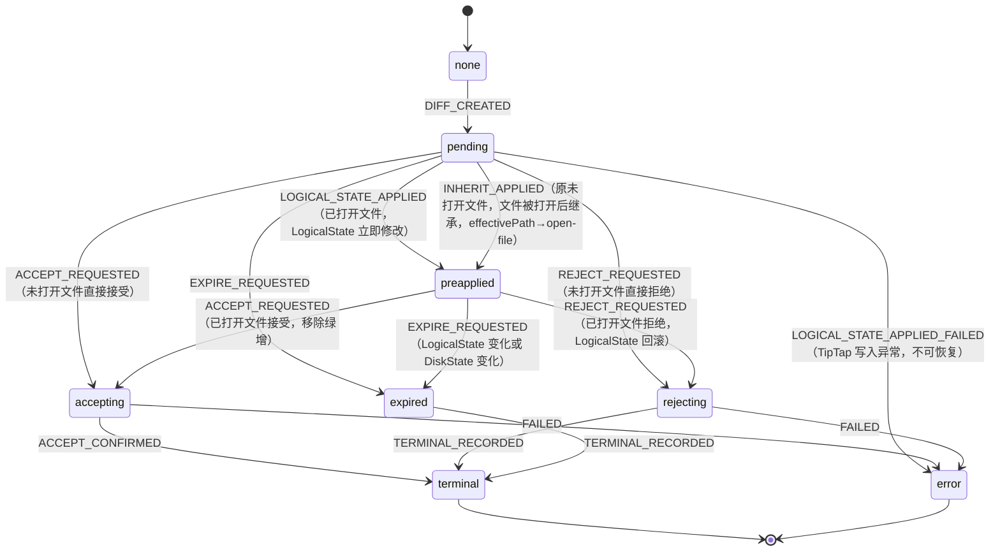

---
文档编号：   DE-M-T-01
文档状态：   A
负责模块：   DE
文档职责：   Diff Review 技术设计与 Phase 13 方案
上游约束：   CORE-C-P-01、DE-M-D-01、SYS-C-T-01、SYS-C-T-02
直接承接：   Phase 13 Issue Trace、diffMachine、diffService 实现
使用边界：   定义 Diff Review 技术方案和规则来源，不写运行时代码
变更要求：   修改状态机、数据结构、持久化协议或 anchor 策略必须同步 SYS-C-T-01 和测试
---

# Diff Review 技术设计

## 1. 当前实现范围（Phase 5 已有）

已实现的 Diff Review MVP 范围：

| 功能 | 实现状态 | 承接规则 |
|------|----------|----------|
| PendingDiff 数据结构（id、filePath、originalText、proposedText、status、summary） | 已实现 | BR-DE-STATE-001 |
| createPendingDiffFromCurrentEditor | 已实现 | BR-DE-STATE-001 |
| canExecutePendingDiff（Phase 13-A：status === "pending"（未打开文件）；Phase 13-B 后扩展为 preapplied（已打开文件）均可执行）| 已实现 | BR-DE-STATE-001 |
| acceptPendingDiff（校验 originalText + 写入） | 已实现 | BR-DE-PERSIST-001 |
| rejectPendingDiff（终态记录） | 已实现 | BR-DE-STATE-002 |
| shouldExpirePendingDiff（路径或内容变化检测） | 已实现 | BR-DE-STATE-003 |
| TerminalDiffCard（diffId、status、message） | 已实现 | BR-DE-STATE-002, BR-DE-STATE-003 |
| diffMachine 状态机（none/pending/accepting/rejecting/expired/terminal/error） | 已实现 | BR-SYS-GOV-001 |

当前 MVP 的限制：

1. PendingDiff 不携带来源信息（无 sourceToolId、无 baseRevision）。
2. 只支持当前已打开文件（无 update_file 未打开文件链路）。
3. 无持久化，应用重启后 PendingDiff 丢失。
4. 无 preapplied 中间状态（diff 创建即修改 LogicalState）。
5. 无绿增展示（依赖 Editor BlockId）。

## 2. Phase 13 技术目标

Phase 13 目标是将当前 PendingDiff MVP 升级到可支撑后续绿增展示、批量操作和持久化恢复的数据结构。

实施顺序：

1. 扩展 PendingDiff 数据结构（Phase 13-A）。
2. 引入 preapplied 状态和三态模型（Phase 13-B）。
3. 升级 diffMachine 状态机（Phase 13-C）。
4. 补充持久化协议（Phase 13-D）。
5. 设计已打开文件 vs 未打开文件的分链路处理（包含继承流，Phase 13-E）。
6. 批量 accept/reject（Phase 13-F，依赖 Phase 13-E）。

## 3. 数据结构设计

### 3.1 PendingDiff（Phase 13-A 扩展）

> **权威源声明**：PendingDiff 完整字段定义以本节（DE-M-T-01 §3.1）为权威；DE-M-P-01 §3 为存储结构说明，字段以本节为准，两处不一致时以本节为准。

```ts
interface PendingDiff {
  id: string;
  filePath: string;           // Workspace 相对路径
  originalText: string;       // 生成 diff 时的文件内容快照
  proposedText: string;       // AI 建议修改后的完整内容
  status: PendingDiffStatus;
  summary: string;            // 来自工具调用的人类可读描述
  // Phase 13-A 新增：
  sourceToolId: string;       // 生成此 diff 的 ToolExecution.id（callId）
  baseRevision: string;       // 文件在生成 diff 时的 DiskState 内容 hash（用于 Inherit 流程校验）
  createdAt: number;          // Unix timestamp
  effectivePath: "open-file" | "closed-file"; // 当前生效的 accept 路径语义
                              // "open-file"：accept 只移除绿增，不写 DiskState
                              // "closed-file"：accept 写 DiskState（须先校验 baseRevision）
                              // Inherit 流程（INHERIT_APPLIED）将 effectivePath 从 "closed-file" 升级为 "open-file"
  // Phase 13-B 新增（状态扩展后使用）：
  anchorRef?: DiffAnchorRef;  // 来自 Editor BlockId 的定位引用（可选）
}

type PendingDiffStatus =
  | "pending"          // 未打开文件路径：等待用户决策；已打开文件路径：短暂过渡态（立即转 preapplied）
  | "preapplied"       // 已打开文件路径：LogicalState 已修改为 proposedText；绿增效果展示中（Phase 13-B）
  | "accepting"        // 内存临时态：用户触发接受，处理中（不写入数据库）
  | "rejecting"        // 内存临时态：用户触发拒绝，处理中（不写入数据库）
  | "expired"          // 终态：LogicalState 变化或 DiskState 变化致失效
  | "accepted"         // 终态：已打开文件→绿增消除；未打开文件→DiskState 已写入
  | "rejected"         // 终态：已打开文件→LogicalState 回滚；未打开文件→文件不变
  | "error";           // 终态：执行出错
```

### 3.2 TerminalDiffCard（保留并扩展）

```ts
interface TerminalDiffCard {
  diffId: string;
  status: "accepted" | "rejected" | "expired" | "error";
  message: string;
  sourceToolId?: string;   // Phase 13-A：追溯来源
  resolvedAt: number;      // Phase 13-A：终态时间戳
}
```

### 3.3 DiffAnchorRef（Phase 13-B，依赖 Editor BlockId）

```ts
interface DiffAnchorRef {
  blockId?: string;          // Editor BlockId（来自 ED-M-T-01）
  lineRange?: [number, number]; // 降级定位：行号范围
}
```

### 3.4 文档三态模型（核心前提）

Diff Review 的所有操作基于以下三态模型：

| 状态 | 定义 | 谁修改 |
|------|------|--------|
| **DiskState** | 磁盘文件永久内容；Workspace 打开时读取 | 仅 Cmd+S 保存；未打开文件 accept 时也直接写 DiskState |
| **LogicalState** | Editor 内存缓冲区（文件未打开时不存在）| 用户编辑、diff preapply（LogicalState = proposedText）、reject 回滚（LogicalState = originalText）|
| **DisplayState** | 渲染层；读 LogicalState + 绿增等效果；无独立存储 | 派生自 LogicalState，不可直接写 |

Diff 对 LogicalState 的操作：
- **createDiff（已打开文件）**：LogicalState → proposedText；diff → preapplied
- **acceptDiff（已打开文件）**：LogicalState 不变（已是 proposedText）；仅移除绿增效果；DiskState 不触碰
- **rejectDiff（已打开文件）**：LogicalState → originalText（回滚）；绿增移除
- **Cmd+S 保存**：LogicalState → DiskState；dirty 清除

### 3.6 DiffStore（Phase 13 收口网关）

所有 PendingDiff 的生命周期必须通过 diffStore 或等价 gateway 管理，不得由各工具直接操作 PendingDiff 状态。

```ts
interface DiffStore {
  pendingDiffs: Map<string, PendingDiff>;     // id → PendingDiff
  terminalCards: TerminalDiffCard[];           // 按时间倒序
}
```

## 4. 状态机设计（Phase 13-B/C 升级）

### 4.1 当前 diffMachine（已有）

```
none → pending → accepting → terminal
              → rejecting → terminal
              → expired   → terminal
              → error
```

### 4.2 Phase 13 扩展状态机



状态语义：

| 状态 | 含义 | 允许操作 |
|------|------|----------|
| pending | 未打开文件：等待用户决策；已打开文件：短暂过渡（立即→preapplied）| accept（未打开）/ reject / expire |
| preapplied | LogicalState 已修改为 proposedText；绿增效果展示中 | accept（移除绿增）/ reject（回滚 LogicalState）/ expire |
| accepting | 内存临时态：已打开文件→移除绿增确认中；未打开文件→写 DiskState 中 | 等待 ACCEPT_CONFIRMED |
| rejecting | 内存临时态：正在记录拒绝（已打开：LogicalState 回滚；未打开：无操作）| 等待 TERMINAL_RECORDED |
| expired | LogicalState 或 DiskState 变化致失效 | 仅允许记录 terminal |
| terminal | 终态 | 不可操作 |
| error | 执行出错终态 | 不可操作 |

### 4.3 状态机约束

1. terminal 和 error 是不可逆终态，不得回到 pending 或任何中间状态。
2. preapplied → reject 必须触发 LogicalState 回滚（见 §4.4 回滚协议），不得只记录终态而留下游离内容。
3. accept 路径由 `effectivePath` 字段决定："open-file" → 只移除绿增，不写 DiskState；"closed-file" → 写 DiskState 前必须校验当前 DiskState hash 与 baseRevision 一致，不一致时转 expired。
4. LOGICAL_STATE_APPLIED 只发生在编辑器已打开对应文件时；未打开文件走 pending → accepting 直接路径；LOGICAL_STATE_APPLIED_FAILED 时 diff 进入 error 终态，向上报告，不可恢复。
5. Accept（effectivePath = "open-file"）= 只移除绿增效果；LogicalState 不变；DiskState 不写；文件保持 dirty。
6. INHERIT_APPLIED 触发时同步将 effectivePath 从 "closed-file" 更新为 "open-file"；后续 accept 走 open-file 路径。

### 4.4 preapplied → reject 回滚协议（DE→ED）

回滚采用**逆补丁 + revision token** 方案（对齐 binder-core DE-M-T-01 §7.5.2）。

PendingDiff 在进入 preapplied 状态时必须额外记录：

```typescript
interface PendingDiff {
  // ... 已有字段 ...
  // preapplied 状态额外字段：
  contentRevisionBeforeApply: string;  // LogicalState 修改前的 revision token
  contentRevisionAfterApply: string;   // LogicalState 修改后的 revision token
}
```

reject 执行逻辑（LogicalState 回滚，DE→ED 事件协议）：

回滚事件：diffMachine 向 editorMachine 发送 `ROLLBACK_LOGICAL_STATE` 事件，携带 `{ diffId: string, targetContent: string /* originalText */ }`；editorMachine 接收后将对应文件 LogicalState 回写为 targetContent。

回滚校验：

1. 读取当前 editor revision token（editorMachine 状态）。
2. 若当前 revision **等于** `contentRevisionAfterApply`：向 editorMachine 发送 `ROLLBACK_LOGICAL_STATE`，回滚 LogicalState 到 `originalText`，diffMachine 进入 rejecting。
3. 若当前 revision **不等于** `contentRevisionAfterApply`：用户在 preapplied 之后继续编辑了 diff 区域，不覆盖用户内容；diffMachine 直接进入 error 终态（errMessage: "reject 时用户已编辑 diff 区域，无法安全回滚"），不发送 ROLLBACK_LOGICAL_STATE。LogicalState 保持用户最新编辑内容不变。

不得在 revision 不匹配时强制覆盖 LogicalState，否则会丢失用户后续编辑。

### 4.5 统一失效规则

**核心规则（面向 LogicalState）**：diff 区域的 LogicalState 变化 → diff 自动失效（EXPIRE_REQUESTED）。

已打开文件（preapplied 状态），失效检测采用**编辑器缓冲区粒度**（对齐 binder-core BR-DE-DIFF-004）：

1. 只有用户编辑**命中 diff 所在区域**（blockId / 行号范围重叠）时才触发 `EXPIRE_REQUESTED`。
2. 非 diff 区域的编辑不误触发失效（允许用户在文档其他部分自由编辑）。
3. 当 diff 区域可被唯一重定位时，更新 anchor offset 后继续审阅，不触发 expire。
4. **新 diff 覆盖同区域时**，新 diff 修改 LogicalState → 旧 diff 区域 LogicalState 变化 → 旧 diff 自然触发失效（diff-on-diff 场景自然处理，不返回冲突错误）。
5. DiskState 变化（外部写入）触发全文件 expire 检测（比较 baseRevision hash）。

## 5. 已打开文件 vs 未打开文件链路（Phase 13-E）

### 5.1 已打开文件链路

工具：`edit_current_editor_document`

```
DIFF_CREATED → pending
→ LOGICAL_STATE_APPLIED（LogicalState = proposedText，编辑器展示绿增）→ preapplied
→ [用户接受] ACCEPT_REQUESTED → accepting → 移除绿增 Decoration → ACCEPT_CONFIRMED → terminal(accepted)
   [LogicalState 不变；DiskState 不写；文件保持 dirty]
→ [用户拒绝] REJECT_REQUESTED → rejecting → LogicalState 回滚 → TERMINAL_RECORDED → terminal(rejected)
→ [LogicalState 变化（用户编辑/新 diff 覆盖）] EXPIRE_REQUESTED → expired → TERMINAL_RECORDED → terminal(expired)
```

### 5.2 未打开文件链路

工具：`update_file`（Phase 11）

```
DIFF_CREATED → pending
   [不修改 LogicalState（文件无 LogicalState）]
→ [用户接受] ACCEPT_REQUESTED → accepting → 校验 DiskState hash → 写入 DiskState → ACCEPT_CONFIRMED → terminal(accepted)
→ [用户拒绝] REJECT_REQUESTED → rejecting → TERMINAL_RECORDED → terminal(rejected)
→ [DiskState 变化 / Workspace 关闭] EXPIRE_REQUESTED → expired → TERMINAL_RECORDED → terminal(expired)
→ [目标文件被打开] INHERIT_APPLIED（DiskState hash 一致时）→ effectivePath 升级为 "open-file" → preapplied → 走已打开文件链路
```

未打开文件不进入 preapplied；继承流（文件被打开时）以 DiskState hash 一致为前提，不一致时自动 expired。

**INHERIT_APPLIED 触发方（事件所有权）**：editorMachine 负责触发。ED-OPEN-FILE 流程完成后，editorMachine 查询 diffStore，对所有 `filePath` 匹配且 `status === "pending"` 且 `effectivePath === "closed-file"` 的 diff 依次发送 `LOGICAL_STATE_APPEARED` 事件至对应 diffMachine；diffMachine 完成 baseRevision 校验：

- 校验通过（当前 DiskState hash == baseRevision）：将 effectivePath 更新为 `"open-file"`，应用 proposedText 到 LogicalState，进入 preapplied；editorMachine 注册绿增 overlay。
- 校验失败：发出 `EXPIRE_REQUESTED`，diff 进入 expired。

## 5-A. Cmd+S 触发绿增固化协议（Phase 13-E）

当用户在 Editor 执行 Cmd+S（保存）且当前文件存在 preapplied diff 时，必须弹出确认对话框（对齐 binder-core BR-DE-DIFF-005）：

```
确认对话框文案：
  "保存所有更改（包含您的编辑和 [N] 处 AI 建议的修改）。"
  [确认保存]  [取消]
```

确认流程：
1. 用户点击"确认保存"：对当前文件所有 preapplied diff 批量执行 ACCEPT（移除绿增效果），全部 accept 确认后执行磁盘写入（LogicalState → DiskState，editorMachine SAVE）。
2. 用户点击"取消"：终止本次保存，不修改任何 diff 状态，dirty 标记保持。
3. 不影响其他文件的 diff。

注：Accept（已打开文件）本身不写入 DiskState；Cmd+S 才是 DiskState 写入的触发器。

## 5-B. 批量操作协议（Phase 13-F）

### 5-B.1 执行顺序

批量 accept/reject 时，执行顺序：
1. 先按**文件分组**（同一文件的 diff 作为一组）。
2. 组内按 **`createdAt` 升序**（先接受较早创建的 diff，避免行号错位）。

### 5-B.2 失败原子性

批量操作采用**跳过继续**（按卡片独立结算）（对齐 binder-core）：

- 某条 diff accept 失败（originalText 不一致、revision conflict 等）：该卡片仅标记为 `error` 终态，不影响其他卡片继续执行。
- 不做全局事务回滚。
- 批量操作完成后，UI 汇总展示：成功 N 条 / 失败 M 条（含 error 原因）。

### 5-B.3 Cmd+S 触发批量绿增固化的原子性

Cmd+S 触发的"固化当前文件全部 preapplied diff"属于批量操作，同样遵循跳过继续原则：

- 若有部分 diff accept 失败，已成功 accept 的 diff 保持 terminal 状态，失败的回 error 状态。
- DiskState 写入（LogicalState → DiskState）只在**当前文件所有待处理 diff 均 accept 成功后**执行；若有失败，不写入 DiskState（等待用户处理失败卡片后重试）。

## 6. 持久化协议（Phase 13-D）

### 6.1 存储位置

PendingDiff 状态存储在 `.binder/workspace.db`（WorkspaceDatabase）中。

表结构（建议）：

```sql
CREATE TABLE pending_diffs (
  id TEXT PRIMARY KEY,
  file_path TEXT NOT NULL,
  original_text TEXT NOT NULL,
  proposed_text TEXT NOT NULL,
  status TEXT NOT NULL,
  summary TEXT NOT NULL,
  source_tool_id TEXT,
  base_revision TEXT,
  created_at INTEGER NOT NULL
);

CREATE TABLE terminal_diff_cards (
  diff_id TEXT PRIMARY KEY,
  status TEXT NOT NULL,
  message TEXT NOT NULL,
  source_tool_id TEXT,
  resolved_at INTEGER NOT NULL
);
```

### 6.2 恢复策略

1. Workspace 重新打开时，从 workspace.db 加载 status 为 `pending` / `preapplied` 的记录。
2. 加载后，检查 baseRevision hash 与当前 DiskState hash 是否一致：不一致时自动转 `expired`。
3. `accepting` / `rejecting` 为内存临时状态，不写入数据库；崩溃恢复时不存在此类 DB 记录。`preapplied` 状态的记录恢复时降级为 `pending`（LogicalState 跨会话不可恢复，回退到未预应用状态，等待文件重新打开后触发继承流）。
4. Workspace 关闭时，所有非终态 diff 转 `expired` 并写入数据库。

## 7. 候选规则（Phase 13 进入实现前升级为正式规则）

| 候选规则 ID | 候选链路 | 来源需求 | 规则意图 |
|-------------|----------|----------|----------|
| DE-CAND-DATA-001 | DE-CREATE-DIFF | REQ-DE-006 | PendingDiff 必须携带 sourceToolId，可追溯到生成它的 ToolExecution。 |
| DE-CAND-STATE-004 | DE-ACCEPT-DIFF | REQ-DE-002 | Accept 前必须校验当前磁盘内容与 originalText 一致；不一致时转 expired，不执行写入。 |
| DE-CAND-STATE-005 | DE-CREATE-DIFF、DE-ACCEPT-DIFF | REQ-DE-001 | preapplied 状态只适用于已打开文件链路（diff 创建时立即修改 LogicalState）；未打开文件保持 pending 直到用户决策；Accept（已打开文件）不写 DiskState。 |
| DE-CAND-PERSIST-002 | DE-ACCEPT-DIFF、DE-REJECT-DIFF | REQ-DE-007 | PendingDiff 状态必须持久化到 workspace.db，应用重启后可恢复或转 expired。 |
| DE-CAND-STATE-006 | DE-EXPIRE-DIFF | REQ-DE-007 | Workspace 关闭时，所有非终态 PendingDiff 必须转 expired 并写入持久化存储。 |

## 8. 已注册正式规则引用

| 规则 ID | 主链路 | 规则意图 |
|---------|--------|----------|
| BR-DE-STATE-001 | DE-CREATE-DIFF | 内容编辑必须进入 PendingDiff，不得直接写文件。 |
| BR-DE-PERSIST-001 | DE-ACCEPT-DIFF | 只有接受后才能写文件。 |
| BR-DE-STATE-002 | DE-REJECT-DIFF | 拒绝后候选修改进入不可执行终态，文件不变。 |
| BR-DE-STATE-003 | DE-EXPIRE-DIFF | 内容变化或定位失效后 PendingDiff 进入 expired，不可继续接受或拒绝。 |

## 9. 验收标准

Phase 13-A（数据结构扩展）完成标准：

1. PendingDiff 携带 sourceToolId、baseRevision、createdAt。
2. TerminalDiffCard 携带 sourceToolId、resolvedAt。
3. 现有 create/accept/reject/expire 主流程不回退。

Phase 13-B/C（状态机升级）完成标准：

1. preapplied 状态正确流转（diff 创建即修改 LogicalState，无 mounted_pending 中间态）。
2. preapplied → reject 触发 LogicalState 回滚（逆补丁 + revision token 校验）。
3. preapplied → reject 在 revision 不匹配时（用户已编辑 diff 区域）进入 error 终态，不发送 ROLLBACK_LOGICAL_STATE，不强制覆盖 LogicalState。
4. 未打开文件链路不进入 preapplied；继承流（文件打开）以 DiskState hash 一致为前提。
5. 统一失效规则：LogicalState 变化（含新 diff 覆盖）自然触发旧 diff expired；非 diff 区域编辑不触发 expire。
6. Accept（已打开文件）不写 DiskState；编辑器文件保持 dirty。
7. 编辑器内只显示绿增（新增绿色），不显示红删；完整 diff 视图只在聊天流中。
8. Cmd+S 时有 preapplied diff 必须弹出确认对话框。
9. 批量 accept 按 createdAt 升序执行，失败卡片独立结算（跳过继续）。

Phase 13-D（持久化）完成标准：

1. PendingDiff 写入 workspace.db。
2. Workspace 重新打开后可恢复 pending diff 或自动 expire。
3. Workspace 关闭时 pending diff 全部转 expired。

## 变更记录

| 日期 | 版本 | 变更内容 |
|------|------|---------|
| 2026-05-23 | v1.0 | 初始版本，定义 Diff Review Phase 13 技术方案、状态机、数据结构、持久化协议和候选规则 |
| 2026-05-23 | v1.1 | §4.4 补充 preapplied→reject 逆补丁+revision token 回滚协议；§4.5 补充编辑器缓冲区粒度失效检测策略；新增 §5-A Cmd+S 触发 accept 协议；新增 §5-B 批量操作协议（执行顺序、失败原子性）；§9 Phase 13-B/C 验收标准扩充。对齐 binder-core。 |
| 2026-05-23 | v1.2 | §1 canExecutePendingDiff 补充 Phase 分阶段说明；PendingDiffStatus 类型注释说明 accepting/rejecting 为内存临时态不写库；§6.2 崩溃恢复步骤 3 修正：accepting/rejecting 不存在于 DB，preapplied 恢复时降级为 mounted_pending。 |
| 2026-05-24 | v1.3 | 全面引入文档三态模型（DiskState/LogicalState/DisplayState）；消除 mounted_pending（无此中间状态，diff 创建即 LOGICAL_STATE_APPLIED → preapplied）；新增 §3.4 三态模型表；§3.1 PendingDiffStatus 完整重写（移除 mounted_pending，按路径拆分 pending/accepted/rejected 语义）；§4.2 状态机重画（LOGICAL_STATE_APPLIED、INHERIT_APPLIED 事件；移除 MOUNT_TO_EDITOR/PREAPPLY_CONTENT）；§4.3 约束更新（Accept 不写磁盘）；§4.5 统一失效规则（LogicalState 变化规则，覆盖 diff-on-diff 场景）；§5.1/5.2 链路重写（含继承流）；§5-A/5-B.3 Cmd+S 语义修正（写盘仍为 Cmd+S，accept 不写盘）；§6.2 恢复降级 preapplied→pending；§7 DE-CAND-STATE-005 更新；§9 B/C 验收标准重写 |
| 2026-05-24 | v1.4 | §3.1 PendingDiff 新增 effectivePath 字段（D-01："open-file"/"closed-file" 路由 accept 语义；INHERIT_APPLIED 时从 closed-file 升级为 open-file）；baseRevision 改为必填（非可选）；§4.2 状态机增加 LOGICAL_STATE_APPLIED_FAILED → error 路径；INHERIT_APPLIED 注释补充 effectivePath 升级语义；§4.3 约束 3/4/5/6 重写（effectivePath 路由、LOGICAL_STATE_APPLIED_FAILED 处置、INHERIT_APPLIED 所有权）；§4.4 回滚协议重写（D-02：revision 不匹配时进入 error 终态而非 conflict 子状态，明确 ROLLBACK_LOGICAL_STATE 事件名和 DE→ED 协议）；§5.2 INHERIT_APPLIED 触发方明确为 editorMachine，补充完整触发流程；§5-A Cmd+S 对话框文案更新（D-07：表述用户编辑 + AI 修改）；§9 B/C 验收标准 3 更新（conflict/expired → error 终态） |
