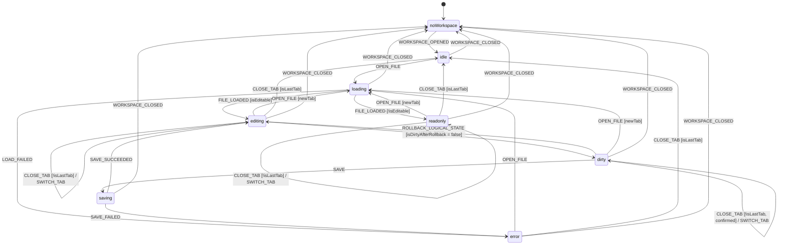

---
文档编号：   ED-M-P-01
文档状态：   A
负责模块：   ED
文档职责：   editorMachine 状态机完整设计——Editor 多标签文件编辑全链路状态驱动
上游约束：   CORE-C-P-01、ED-M-D-01、ED-M-T-01、ED-M-T-02、SYS-C-T-01（BR-ED-STATE-001~005）
直接承接：   Phase 9/13 editorMachine 实现、ED-OPEN-FILE / ED-SAVE-FILE Issue Trace
使用边界：   定义 editorMachine 状态、事件、Context 和门禁约束，不写 TipTap / XState 运行时代码
变更要求：   新增状态、事件或 Context 字段必须同步 SYS-C-T-01 §4、ED-M-T-01 §5-B 和测试矩阵
---

# EditorMachine 状态机设计

## 1. 设计原则

1. Editor 多标签文件会话全部由 editorMachine 驱动，不存在游离于状态机之外的编辑状态。
2. editorMachine 维护 EditorTab 集合和 activeTabId，机器**整体状态**由当前活跃 Tab 的状态决定。
3. ROLLBACK_LOGICAL_STATE（来自 diffMachine）是唯一允许从外部触发 LogicalState 变更的路径；用户编辑通过 USER_EDIT 事件。
4. ACTIVE_FILE_CHANGED 和 LOGICAL_STATE_APPEARED 是 editorMachine 的出站广播事件，其他模块不得代发。
5. Accept diff 操作（移除绿增）不修改 LogicalState，不触发 dirty 状态变化（Apply-first 模型，见 ED-M-T-01 §5-A）。

## 2. 状态定义



## 3. 状态语义

| 状态 | 语义 | 允许操作 |
|------|------|----------|
| `noWorkspace` | 无 Workspace；编辑器不可用 | 等待 WORKSPACE_OPENED |
| `idle` | Workspace 已打开，无 Tab | OPEN_FILE |
| `loading` | 文件加载中（TipTap 初始化 / 内容读取）| 等待 FILE_LOADED / LOAD_FAILED |
| `editing` | 活跃 Tab 可编辑（md/txt），LogicalState == DiskState | USER_EDIT / SAVE / CLOSE_TAB / SWITCH_TAB / OPEN_FILE |
| `dirty` | 活跃 Tab 可编辑，LogicalState ≠ DiskState（含用户编辑或 diff preapply 结果）| SAVE / CLOSE_TAB（需确认）/ SWITCH_TAB / OPEN_FILE / ROLLBACK_LOGICAL_STATE |
| `saving` | Cmd+S 写磁盘中（LogicalState → DiskState）| 等待 SAVE_SUCCEEDED / SAVE_FAILED |
| `readonly` | 活跃 Tab 只读（非 md/txt 文件；BR-ED-STATE-001）| OPEN_FILE / CLOSE_TAB / SWITCH_TAB |
| `error` | 文件加载或保存失败 | OPEN_FILE（重试或新文件）/ CLOSE_TAB |

**关于 `dirty` 和 diff Apply-first 的关系：**

diff 创建（edit_current_editor_document）立即执行 `applyDiffReplaceInEditor`，LogicalState 发生变化，
editorMachine 进入 `dirty` 状态（LogicalState ≠ DiskState）。这是 Apply-first 模型的核心语义：
diff preapply 不是独立状态，而是 dirty 状态的一种来源。

## 4. 事件定义

### 4.1 入站事件

| 事件 | 触发来源 | 语义 | 携带数据 |
|------|----------|------|----------|
| `WORKSPACE_OPENED(workspaceRoot)` | workspaceMachine | Workspace 就绪，editorMachine 从 noWorkspace → idle | `workspaceRoot: string` |
| `WORKSPACE_CLOSED` | workspaceMachine | 强制清空所有 Tab，回到 noWorkspace；不等待用户确认 | — |
| `OPEN_FILE(filePath)` | User（文件树点击 / 拖拽）| 打开文件；若已打开则激活既有 Tab（BR-ED-STATE-002）| `filePath: string` |
| `FILE_LOADED(filePath, fileType, content)` | SYS（文件读取 + TipTap 初始化完成）| 加载完成，按 fileType 进入 editing 或 readonly | `filePath, fileType, content` |
| `LOAD_FAILED(filePath, errorMessage)` | SYS | 文件读取或 TipTap 初始化失败 | `filePath, errorMessage` |
| `USER_EDIT` | SYS（TipTap docChanged 事务，非 suppressedSync）| 用户键入或删除内容，LogicalState 变化 → dirty | — |
| `SAVE` | User（Cmd+S）| 触发 LogicalState → DiskState 写盘 | — |
| `SAVE_SUCCEEDED` | SYS（Tauri write_file 完成）| 写盘成功；DiskState 更新；isDirty → false | — |
| `SAVE_FAILED(errorMessage)` | SYS | 写盘失败；LogicalState 保持 dirty | `errorMessage` |
| `CLOSE_TAB(filePath)` | User（Tab ✕ 按钮）| 关闭指定 Tab；若 dirty 需确认（BR-ED-STATE-003）| `filePath` |
| `SWITCH_TAB(filePath)` | User（点击 Tab 标签）| 切换活跃 Tab；更新 activeTabId；发出 ACTIVE_FILE_CHANGED | `filePath` |
| `ROLLBACK_LOGICAL_STATE(diffId, appliedRange, originalText)` | diffMachine（reject 路径）| 在 appliedRange 位置精确将 newText 替换回 originalText；重新评估 isDirty | `diffId, appliedRange: {from, to}, originalText` |

### 4.2 出站事件

| 事件 | 接收方 | 触发条件 | 协议来源 |
|------|--------|----------|----------|
| `ACTIVE_FILE_CHANGED(oldPath, newPath)` | chatMachine | SWITCH_TAB / OPEN_FILE 导致 activeTabId 变化 | AG-M-P-04 §4/§6.6：chatMachine 追加合成系统消息，不触发状态转移 |
| `LOGICAL_STATE_APPEARED(filePath)` | diffMachine（每个匹配实例）| FILE_LOADED 完成后，对 `filePath` 匹配 + `status=pending` + `effectivePath=closed-file` 的 diff 依次发送 | DE-M-T-01 §5.2：触发 Inherit Flow；hash 一致→INHERIT_APPLIED；不一致→EXPIRE_REQUESTED |

**出站事件约束：**
- `LOGICAL_STATE_APPEARED` 按 diff 的 `createdAt` 升序顺序发送，不并行
- `ACTIVE_FILE_CHANGED` 在 `noWorkspace` 时不发送（chatMachine 无法接收）
- 两个出站事件的唯一触发方均为 editorMachine

## 5. Context 定义

```typescript
interface EditorMachineContext {
  tabs: EditorTab[];
  activeTabId: string | null;
  errorMessage: string | null;
}

interface EditorTab {
  id: string;
  filePath: string;                      // Workspace 相对路径
  fileType: "md" | "txt" | "other";     // 决定 TipTap 序列化路径（ED-M-T-01 §3、ED-M-T-02 §4）
  dirty: boolean;                        // LogicalState ≠ DiskState
}
```

Context 变更规则：

1. `tabs` 通过 OPEN_FILE 追加（或激活已有）、CLOSE_TAB 移除、WORKSPACE_CLOSED 全部清空。
2. `activeTabId` 在 SWITCH_TAB / OPEN_FILE / CLOSE_TAB（最后一个 Tab 或切换到下一个）时更新；WORKSPACE_CLOSED 后清为 null。
3. `dirty` 在 USER_EDIT 时设 true、SAVE_SUCCEEDED 时设 false、ROLLBACK_LOGICAL_STATE 后重新计算（`isDirty = LogicalState ≠ DiskState`）。
4. `errorMessage` 在 LOAD_FAILED / SAVE_FAILED 时写入，OPEN_FILE（重试）时清空。
5. **不在 Context 中存储 LogicalState 或 DiskState 内容**——内容由 TipTap 实例持有，editorMachine 只持有元数据。

## 6. 门禁约束

### 6.1 OPEN_FILE 门禁

收到 OPEN_FILE 时：

1. 若 `tabs.some(t => t.filePath === filePath)`：激活既有 Tab（不重新加载），不进入 loading 状态（BR-ED-STATE-002）。
2. 否则：创建新 Tab 条目，进入 loading 状态，加载文件内容，初始化 TipTap 实例。

### 6.2 CLOSE_TAB 门禁（BR-ED-STATE-003）

关闭 dirty Tab 时必须展示确认对话框：

```
选项 1：保存并关闭 → SAVE → SAVE_SUCCEEDED → 关闭 Tab
选项 2：放弃并关闭 → 直接关闭 Tab（丢弃 LogicalState 变更）
选项 3：取消 → 保持 Tab 打开，不触发任何状态转移
```

WORKSPACE_CLOSED 收到时：不经此确认直接关闭所有 Tab（workspaceMachine 已在 Closing 状态处理了用户确认）。

### 6.3 FILE_LOADED 路由（BR-ED-STATE-001）

```
fileType === "md" 或 "txt" → editing 状态（TipTap 可编辑实例）
fileType === "other"        → readonly 状态（TipTap 或 textarea，只读渲染）
```

`.md` 使用 TipTap + Markdown storage（`tiptap-markdown`）；
`.txt` 共用 TipTap 实例，纯文本序列化（无 Markdown 转换）（BR-ED-PERSIST-003）。

### 6.4 ROLLBACK_LOGICAL_STATE 处理

收到 `ROLLBACK_LOGICAL_STATE(diffId, appliedRange, originalText)` 后：

1. 调用 `deleteRange(appliedRange).insertContentAt(appliedRange.from, originalText)`（精确回滚）。
2. 重新计算 `isDirty = (LogicalState ≠ DiskState)`。
3. 若 isDirty 为 false → 转 editing；仍为 true → 保持 dirty。
4. 回滚操作使用 `withSuppressedPendingContentSync` 包裹，防止触发 USER_EDIT 误判。

### 6.5 SAVE 语义（ED-M-T-01 §5-A 边界）

- SAVE（Cmd+S）将 LogicalState 写入 DiskState（`write_workspace_file`）。
- 若文件有 preapplied diff（绿增展示中），保存前 UI 询问用户是否先批量 accept diff（DE-M-T-01 §5.2 Cmd+S 对话框语义）。
- Accept diff 操作（移除绿增）不修改 LogicalState，不触发 dirty 状态变化。
- **SAVE 只写当前活跃 Tab 对应的文件，绝对不写其他文件**（BR-ED-PERSIST-001）。

## 7. 与其他文档的关系

| 文档 | 关系 |
|------|------|
| ED-M-D-01 功能主控 | 需求来源（REQ-ED-001~008）|
| ED-M-T-01 Editor 技术架构 | TipTap 实现层规范；DiffDecoration；§5-A 三态模型；§5-B 出站事件（本文来源）|
| ED-M-T-02 TipTap 选型 | md/txt 文件类型边界（§4）；TipTap 依赖选型 |
| WS-M-P-02 WorkspaceMachine | WORKSPACE_OPENED / WORKSPACE_CLOSED 事件来源 |
| AG-M-P-04 ChatMachine | ACTIVE_FILE_CHANGED 接收方 |
| DE-M-T-01 DiffReview | LOGICAL_STATE_APPEARED 接收方（diffMachine）；ROLLBACK_LOGICAL_STATE 发送方 |
| SYS-C-T-01 §4 | editorMachine 注册入口（BR-ED-STATE-001~005） |

## 8. 验收标准

实现完成后必须满足：

1. 打开同一文件时复用既有 Tab，不重新加载（BR-ED-STATE-002）。
2. 关闭 dirty Tab 前必须展示确认对话框（BR-ED-STATE-003）；WORKSPACE_CLOSED 时跳过此确认。
3. `.md` 保存失败（Markdown 转换失败）时不写磁盘，保留 dirty 状态（BR-ED-PERSIST-002）。
4. `.txt` 使用 TipTap 纯文本序列化，不退回 textarea（BR-ED-PERSIST-003）。
5. ROLLBACK_LOGICAL_STATE 正确执行精确回滚，且不触发 USER_EDIT 事件。
6. ACTIVE_FILE_CHANGED 在每次 activeTabId 变化时发出，且唯一由 editorMachine 发出。
7. LOGICAL_STATE_APPEARED 按 diff createdAt 升序顺序发送，不并行。
8. 状态转移覆盖 noWorkspace / idle / loading / editing / dirty / saving / readonly / error 全路径。

## 变更记录

| 日期 | 版本 | 变更内容 |
|------|------|---------|
| 2026-05-24 | v1.0 | 初始版本；完整定义 editorMachine 状态机（状态图、入站/出站事件表、Context、门禁约束），补全 SYS-C-T-01 §4 注册级描述；对齐 ED-M-T-01 Apply-first 模型、ROLLBACK_LOGICAL_STATE 协议和出站事件所有权 |
