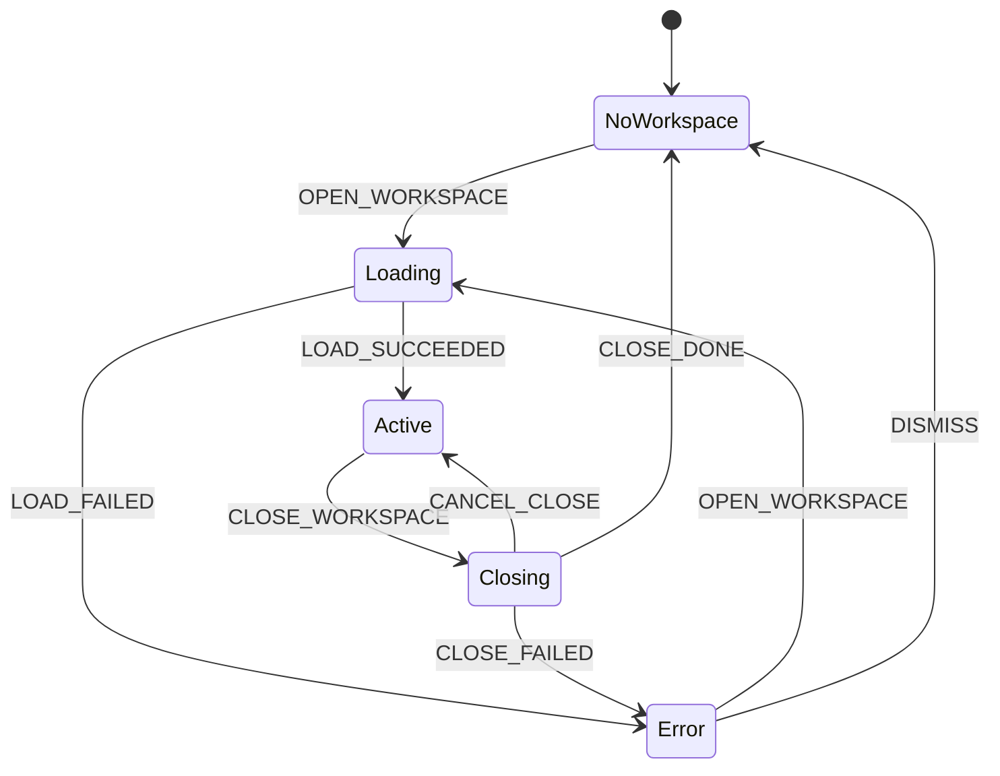

---
文档编号：   WS-M-P-02
文档状态：   A
负责模块：   WS
文档职责：   workspaceMachine 状态机完整设计——Workspace 生命周期全链路状态驱动
上游约束：   CORE-C-P-01、WS-M-D-01、SYS-C-T-01（BR-WS-STATE-001/002/003）、SYS-C-T-02
直接承接：   Phase 13 workspaceMachine 实现、WS-OPEN / WS-CLOSE Issue Trace
使用边界：   定义 workspaceMachine 状态、事件、Context 和门禁约束，不写 XState 运行时代码
变更要求：   新增状态、事件或 Context 字段必须同步 SYS-C-T-01 §4 和 WS-M-P-01
---

# WorkspaceMachine 状态机设计

## 1. 设计原则

1. Workspace 生命周期全部由 workspaceMachine 驱动，不存在游离于状态机之外的 Workspace 中间状态。
2. workspaceMachine 管理 Workspace 打开、初始化、正常工作和关闭的完整流程。
3. 所有合法状态转移必须通过显式事件触发，不允许直接修改 Context。
4. WORKSPACE_OPENED / WORKSPACE_CLOSED 是跨模块广播事件，workspaceMachine 是唯一发送方。

## 2. 状态定义



## 3. 状态语义

| 状态 | 语义 | 允许操作 |
|------|------|----------|
| `NoWorkspace` | 无 Workspace 打开；应用初始态；文件操作、编辑、Agent 均不可用 | OPEN_WORKSPACE |
| `Loading` | Workspace 加载中：DB 初始化 → FTS5 重建 → PendingDiff 恢复；用户不可操作 | 等待 LOAD_SUCCEEDED / LOAD_FAILED |
| `Active` | Workspace 已激活；所有功能可用 | CLOSE_WORKSPACE / 文件操作 / 编辑 / Agent |
| `Closing` | 关闭流程中：检查 dirty tabs 和 pending diffs → 用户确认 → 清理序列 | CANCEL_CLOSE / CONFIRM_CLOSE |
| `Error` | 初始化或关闭失败；显示错误信息 | OPEN_WORKSPACE（重试或换路径）/ DISMISS |

## 4. 事件定义

### 4.1 入站事件

| 事件 | 触发来源 | 语义 | 携带数据 |
|------|----------|------|----------|
| `OPEN_WORKSPACE` | User（Workspace 选择器）| 用户选择打开某 Workspace | `workspaceRoot: string` |
| `LOAD_SUCCEEDED` | SYS（初始化序列完成）| DB + 索引 + diff 加载全部完成 | — |
| `LOAD_FAILED` | SYS（初始化任一步骤失败）| 加载失败，进入 Error | `errorMessage: string` |
| `CLOSE_WORKSPACE` | User（关闭按钮 / 切换 Workspace）| 用户触发关闭当前 Workspace | — |
| `CONFIRM_CLOSE` | User（确认对话框 → 确认）| 用户确认放弃未保存内容并关闭 | — |
| `CANCEL_CLOSE` | User（确认对话框 → 取消）| 用户取消关闭，回到 Active | — |
| `CLOSE_DONE` | SYS（清理序列完成）| 所有清理步骤完成，Workspace 已关闭 | — |
| `CLOSE_FAILED` | SYS（清理序列出错）| 关闭过程发生不可恢复错误 | `errorMessage: string` |
| `DISMISS` | User（Error 状态下）| 清除错误，回到 NoWorkspace | — |

### 4.2 出站事件

| 事件 | 接收方 | 触发时机 | 语义 |
|------|--------|----------|------|
| `WORKSPACE_OPENED(workspaceRoot)` | chatMachine、editorMachine | Loading → Active（LOAD_SUCCEEDED 后）| 通知各模块 Workspace 已就绪，可开始工作 |
| `WORKSPACE_CLOSED` | chatMachine、editorMachine、所有 diffMachine 实例 | Closing → NoWorkspace（CLOSE_DONE 前）| 通知各模块执行清理（持久化、状态清空、expire 等） |

**约束：**
- workspaceMachine 是 WORKSPACE_OPENED / WORKSPACE_CLOSED 的唯一发送方
- WORKSPACE_CLOSED 必须在清理序列开始前发出，让各模块自行完成清理后再等待 CLOSE_DONE

## 5. Context 定义

```typescript
interface WorkspaceMachineContext {
  workspaceRoot: string | null;   // 当前 Workspace 根路径；NoWorkspace 时为 null
  errorMessage: string | null;    // 最近一次错误信息；非 Error 状态时为 null
}
```

Context 变更规则：
1. `workspaceRoot` 在 OPEN_WORKSPACE 时写入，CLOSE_DONE 后清空。
2. `errorMessage` 在 LOAD_FAILED / CLOSE_FAILED 时写入，OPEN_WORKSPACE / DISMISS 时清空。
3. 不在 Context 中存储 dirty 状态或 pending diff 计数——这些由 editorMachine / diffMachine 持有，workspaceMachine 在需要时查询。

## 6. 门禁约束

### 6.1 CLOSE_WORKSPACE 门禁（BR-WS-STATE-003）

收到 CLOSE_WORKSPACE 后，workspaceMachine 进入 Closing 状态并执行以下检查：

```
检查 1：editorMachine 是否存在 dirty tab？
检查 2：diffMachine 实例中是否存在 preapplied（非终态）PendingDiff？

两项均为否 → 跳过确认对话框，直接进入清理序列（CLOSE_DONE 路径）
任一为是 → 展示确认对话框：
  - 用户确认（CONFIRM_CLOSE）→ 进入清理序列
  - 用户取消（CANCEL_CLOSE）→ 回到 Active
```

确认对话框文案（参考）：
> "当前有未保存的编辑或待处理的 AI 修改建议。关闭后这些内容将丢失。确认关闭？"

### 6.2 Closing 清理序列

CONFIRM_CLOSE（或无 blocker 直接关闭）后，按顺序执行：

```
1. 发出 WORKSPACE_CLOSED 事件至所有订阅方（chatMachine、editorMachine、diffMachine）
   └─ chatMachine：先持久化 messages 到 workspace.db，再清空内存状态
   └─ editorMachine：清空所有 tabs，重置 activeTabId
   └─ diffMachine（每个实例）：非终态 diff 自动转 expired（expireAllOnClose）
2. 等待所有订阅方完成清理（或超时后继续）
3. 关闭 workspace.db 和 search.db 连接
4. 清空 Context.workspaceRoot
5. 发出 CLOSE_DONE（内部事件，触发 Closing → NoWorkspace 转移）
```

### 6.3 Loading 序列（WS-M-P-01 §4 对应）

OPEN_WORKSPACE 后，Loading 状态内按顺序执行：

```
1. 确认 {workspaceRoot}/.binder/ 目录存在（不存在则创建）
2. 打开或创建 {workspaceRoot}/.binder/workspace.db
3. 检查 schema 版本，执行迁移 DDL（如需）
4. 重建 FTS5 索引（写入 .binder/search.db）
5. 调用 loadDiffsFromWorkspace（加载非终态 PendingDiff 记录，重建 diffMachine 实例）
6. 全部成功 → LOAD_SUCCEEDED
   任一失败 → LOAD_FAILED(errorMessage)
```

## 7. 与其他文档的关系

| 文档 | 关系 |
|------|------|
| WS-M-D-01 功能主控 | 需求来源（REQ-WS-001/005/009）|
| WS-M-P-01 WorkspaceDB 结构 | Loading 序列的 DB 初始化规范（上游）|
| WS-M-T-01 FTS5 搜索索引 | Loading 序列的索引重建规范（上游）|
| AG-M-P-04 ChatMachine | WORKSPACE_OPENED/CLOSED 接收方；AG-CAND-PERSIST-001 覆盖持久化语义 |
| ED-M-P-01 EditorMachine | WORKSPACE_OPENED/CLOSED 接收方；dirty tab 查询对象 |
| DE-M-T-01 DiffReview | WORKSPACE_CLOSED 触发 expireAllOnClose；加载时重建 diffMachine 实例 |
| SYS-C-T-01 §4 | workspaceMachine 注册入口（BR-WS-STATE-001/002/003）|

## 8. 验收标准

实现完成后必须满足：

1. Workspace 打开流程（DB + 索引 + diff 加载）全部在 Loading 状态内完成，完成前 UI 不可操作。
2. Active 状态下所有文件操作、编辑、Agent 功能可用。
3. 存在 dirty tab 或 preapplied diff 时，关闭前必须展示确认对话框（BR-WS-STATE-003）。
4. 确认关闭后，chatMachine 完成持久化才清空 messages；diffMachine 所有非终态 diff 转 expired。
5. WORKSPACE_OPENED / WORKSPACE_CLOSED 仅由 workspaceMachine 发出，不存在其他发送路径。
6. Error 状态支持重试（OPEN_WORKSPACE）和清除（DISMISS），两条路径均可通过测试观测。

## 变更记录

| 日期 | 版本 | 变更内容 |
|------|------|---------|
| 2026-05-24 | v1.0 | 初始版本；完整定义 workspaceMachine 状态机（状态图、事件表、Context、门禁约束、清理序列），补全 SYS-C-T-01 §4 注册级描述 |
