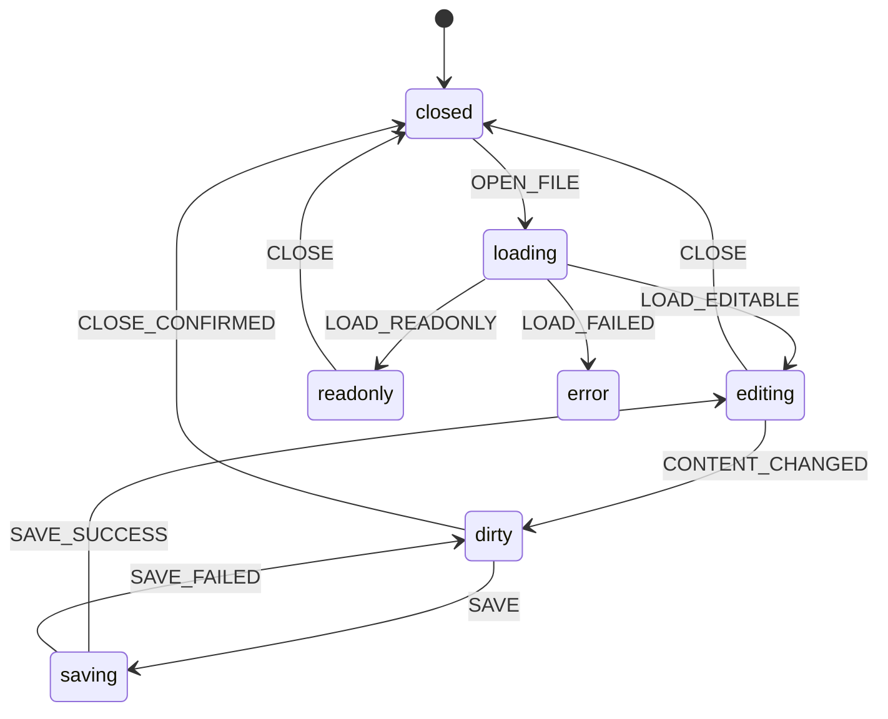

---
文档编号：   ED-M-T-01
文档状态：   X
负责模块：   ED
文档职责：   Editor 技术架构与 Phase 9 方案
上游约束：   CORE-C-P-01、ED-M-D-01、SYS-C-T-01、SYS-C-T-02、binder-core/A-ED-M-T-01
直接承接：   后续 Editor 多标签、dirty、TipTap、BlockId、DiffDecoration 实现 Issue Trace
使用边界：   定义 Editor Phase 9 技术方案和验收口径，不写运行时代码
变更要求：   修改状态机、Markdown 转换、BlockId 或 DiffDecoration 策略必须同步 SYS-C-T-01 和测试
---

# Editor 技术架构

## 1. 目标

将当前单 textarea / 单文件 Editor MVP 演进为可承载多文件编辑、Diff 定位和绿审态展示的 Editor Runtime。

Phase 9 技术目标：

1. 多标签数据结构可表达每个打开文件的独立状态。
2. dirty 标记、关闭保护和状态栏成为显式规则来源。
3. TipTap/Markdown 方案先确认边界，再进入依赖和代码实现。
4. BlockId / DocumentAnchor 由 Editor Runtime 生成或校验。
5. DiffDecoration 只消费已验证 range/anchor，不自行全文搜索定位。

## 2. 状态模型

### 2.1 单标签状态机

单个标签页使用 `editorMachine` 或等价状态机表达：



约束：

1. `dirty` 不得被 tab 切换清除。
2. `saving` 中不得并发启动第二次保存。
3. `readonly` 文件不能进入保存路径。
4. `dirty` 标签关闭必须先确认或被上游 Workspace guard 阻断。

### 2.2 多标签数据结构

建议结构：

```ts
interface EditorTab {
  id: string;
  workspaceRoot: string;
  filePath: string;
  content: string;
  mode: "editable" | "readonly";
  dirty: boolean;
  status: "loading" | "editing" | "dirty" | "saving" | "readonly" | "error";
  error?: string;
}

interface EditorSession {
  tabs: EditorTab[];
  activeTabId: string | null;
}
```

约束：

1. `id` 是 UI 会话标识，不替代 Workspace 相对路径。
2. `filePath` 必须是 Workspace 相对路径。
3. 同一 Workspace 内同一文件默认复用已有 tab，不重复打开。
4. 切换 Workspace 前必须检查全部 tab 的 dirty 状态。

## 3. TipTap/Markdown 方案

TipTap/Markdown 选型以 `ED-M-T-02` 为准。

已确认依赖候选：

1. `@tiptap/react`
2. `@tiptap/starter-kit`
3. `@tiptap/extension-placeholder`
4. `@tiptap/pm`
5. `tiptap-markdown`

技术边界：

1. `.md` 使用 TipTap/ProseMirror 承载编辑体验，保存时输出 Markdown 文本。
2. `.txt` 可以继续使用纯文本路径，直到 TipTap 纯文本策略被验证。
3. Markdown 读写转换必须保留标题、列表、引用、代码块等基础语义。
4. 转换失败不得覆盖原文件；必须保留 dirty 状态并暴露错误。

## 4. BlockId / Anchor 策略

BlockId 目标是为后续 Diff Review v2 提供比全文搜索更稳定的定位辅助。

最小策略：

1. 顶层块可生成 `blockId` 或等价 `DocumentAnchor`。
2. BlockId 由 Editor Runtime 生成、修复和校验。
3. 模型可以引用 BlockId，但不能凭模型输出直接越过校验。
4. 缺失、重复或无法解析时，PatchValidation 必须降级为弱定位或拒绝执行。

持久化策略需在实现前二选一：

| 策略 | 说明 | 风险 |
|------|------|------|
| Markdown 内嵌标记 | 在 Markdown 中保留 block metadata | 可能污染用户源文 |
| workspace.db 映射表 | 在 `.binder/workspace.db` 维护 path + block hash + id | 需要重建和冲突处理 |

本项目初始建议：先采用 `workspace.db` 映射表方案草案，不直接污染 Markdown 源文；实现前必须补专项设计。

## 5. DiffDecoration 绿审态

DiffDecoration 只负责 ViewState 展示，不拥有 Diff 生命周期。

约束：

1. 数据来源必须是 DE / Diff Review 产生的 pending diff。
2. 绿审位置必须来自已验证 range/anchor。
3. 无法解析 range/anchor 时，不得用全文搜索伪造高亮。
4. Accepted / Rejected / Expired / Error 等终态不在编辑器长期保留可执行高亮。

## 6. 候选规则

以下规则是 Phase 9 后续实现候选，尚未登记为 `SYS-C-T-01` 的正式 RULE。进入代码实现前必须升级为正式规则、补 `@GOV` owner 和测试覆盖。

| 候选规则 | 候选链路 | 来源需求 | 规则意图 |
|----------|----------|----------|----------|
| ED-CAND-DATA-002 | ED-OPEN-FILE | REQ-ED-007 | BlockId / Anchor 必须由 Editor Runtime 生成或校验。 |
| ED-CAND-STATE-004 | ED-DIFF-RENDER | REQ-ED-008 | DiffDecoration 只能消费已验证 range/anchor。 |

已升级为正式规则：

| 正式规则 | 主链路 | 来源需求 | 规则意图 |
|----------|--------|----------|----------|
| BR-ED-STATE-002 | ED-OPEN-FILE | REQ-ED-003 | 多标签必须保留每个打开文件的独立内容、dirty 和状态；重复打开同一文件时复用既有标签。 |
| BR-ED-STATE-003 | ED-SAVE-FILE | REQ-ED-004 | dirty 标签关闭或 Workspace 切换前必须确认、保存或阻断。 |
| BR-ED-STATE-004 | ED-OPEN-FILE | REQ-ED-005 | 状态栏必须从 active tab 派生当前文件、保存状态和基础统计信息。 |
| BR-ED-PERSIST-002 | ED-OPEN-FILE、ED-SAVE-FILE | REQ-ED-006 | `.md` 必须通过 TipTap/Markdown 运行时维护 Markdown 文本；转换失败不得覆盖磁盘内容。 |

## 7. 验收标准

实现完成后必须满足：

1. md/txt 打开保存主流程不回退。
2. 多标签切换不丢失 dirty 内容。
3. 关闭 dirty 标签或切换 Workspace 有保护路径。
4. Markdown 保存转换失败不会写坏原文件。
5. BlockId 不由模型输出直接决定执行位置。
6. DiffDecoration 无验证 range/anchor 时不渲染伪高亮。

## 变更记录

| 日期 | 版本 | 变更内容 |
|------|------|---------|
| 2026-05-22 | v1.4 | 将 Markdown 转换候选规则升级为 BR-ED-PERSIST-002 |
| 2026-05-22 | v1.3 | 引用 ED-M-T-02，确认 TipTap/Markdown 选型候选 |
| 2026-05-22 | v1.2 | 将 dirty 关闭保护和状态栏候选规则升级为正式规则 |
| 2026-05-22 | v1.1 | 将多标签候选规则升级为 BR-ED-STATE-002 |
| 2026-05-22 | v1.0 | 初始版本，定义 Editor Phase 9 技术架构草稿 |
